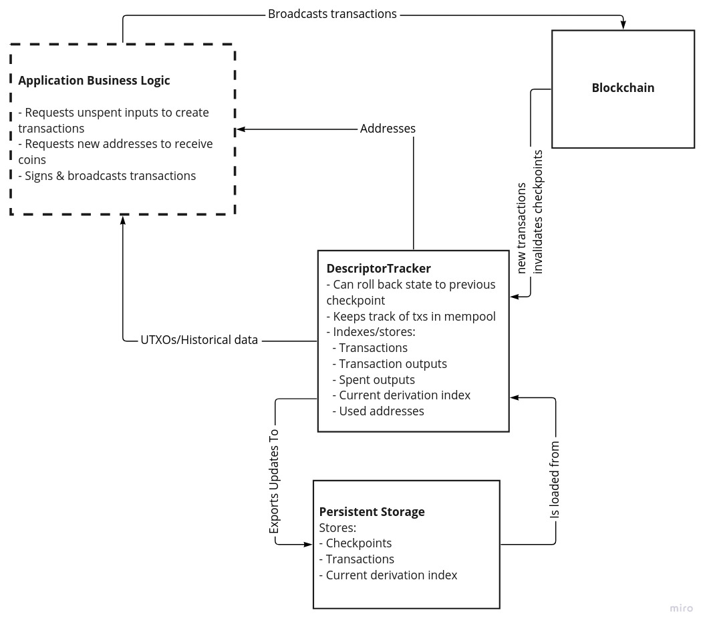

The Bitcoin Devkit (BDK) lets you do a lot of useful things through convenient high level
abstractions. It works great when these abstractions map nicely onto what you are trying to do. My
goal is to develop a new `bdk_core` library for when they don't. I want `bdk_core` to expose all the
useful *mechanisms* that BDK has inside it without them being tied to any particular usage *policy*
and with very minimal dependencies.

The `bdk_core` idea is still "in the lab". We're not sure yet whether `bdk_core` will just be what's
left of `bdk` once we spin off all the components that have extra dependencies into their own crates
and refine it a bit. In that case `bdk_core` will just be called `bdk v1.0.0` or something. Or it might
be that `bdk` lives on with its current APIs and uses stuff `bdk_core` to implement it internally.

## The separation of policy and mechanism

My guiding principle for `bdk_core` is the *separation of policy and mechanism*. This is
what I mean by these terms:

- *mechanism*: How you do a particular thing. Mechanism code is functional and doesn't change much.
- *policy*: What you want to do. Policy code composes mechanisms to achieve something in
  an application.

Here's a nice passage about why the designers of the [X window system] applied this principle. X has
been around since 1984 and doesn't look like it's going anywhere so it probably has a lot to teach us.
From *[The Art of UNIX Programming]*:

> ...we observed that the designers of X made a basic decision to implement “mechanism, not policy”—to
> make X a generic graphics engine and leave decisions about user-interface style to toolkits and
> other levels of the system. We justified this by pointing out that policy and mechanism tend to
> mutate on different timescales, with policy changing much faster than mechanism. Fashions in the
> look and feel of GUI toolkits may come and go, but raster operations and compositing are forever.

> Thus, hardwiring policy and mechanism together has two bad effects: It makes policy rigid and
> harder to change in response to user requirements, and it means that trying to change policy has a
> strong tendency to destabilize the mechanisms.

> On the other hand, by separating the two we make it
> possible to experiment with new policy without breaking mechanisms. We also make it much easier to
> write good tests for the mechanism (policy, because it ages so quickly, often does not justify the
> investment).

  * [ ] > This design rule has wide application outside the GUI context. In general, it implies that we
> should look for ways to separate interfaces from engines.

You'll notice we have a similar situation in Bitcoin engineering. We have mechanism code like
signing algorithms, key derivation, transaction construction logic, etc., that don't change much. But
how these compose together in applications changes quickly over time and between applications.

The main culprit of policy and mechanism conflation in `bdk` is the main [`Wallet`] type.
Wallets do all of the following:

1. Store one or two descriptors (external and optional internal).
2. Keep track of which addresses you've given out so you only give out fresh ones from each descriptor.
3. Keep a list of transactions associated with the addresses in the wallet.
4. Given a source of blockchain data it can update its internal list of transactions.
5. Given some parameters it can build a PSBT from transaction outputs.
6. Given a PSBT it can sign it with its [`Signers`][`Signer`].

All of that is very useful but it is bound together with the particular policies and opinions of `Wallet`.
If `Wallet`'s policy is not your policy it's going to be tricky to get it to do what you want.
Here are some examples:

1. In order to control how the `Wallet` will select coins for a transaction internally you have to
   pass in something implementing the [`CoinSelectionAlgorithm`] trait. A coin selection algorithm
   is clearly mechanism code but the policy of `Wallet` restricts that mechanism's interface. We
   have [very old issues](https://github.com/bitcoindevkit/bdk/issues/281) related to what the
   interface of this trait should be and we don't have a clear way forward. In `bdk_core` I want to
   purely provide the coin selection mechanisms for figuring out whether you need to select more
   UTXOs or whether you need a change output etc. How you use that mechanism will be up to you.
2. Another trait that has a similar structure is the [`Signer`] trait. You have to pass in signers
   so your wallet can sign PSBTs but you have little control over how the wallet chooses which
   signers to use in any given situation. Right now the wallet will just iterate through all the
   signers and ask them to sign. This is not always appropriate. In `bdk_core` I want to provide
   functions for populating PSBTs given something that can sign. You'll be in control of when they
   get called.

## A syncing mechansim without the policy

Syncing in `bdk` is the place where the design of `Wallet` is most restrictive. The [`WalletSync`]
trait forces you to sync all addresses in a wallet in one big batch. But this is not always what you
want to do. I spoke to a developer who wanted to sync his wallet slowly over time with each address
being queried over a different Tor connection. It would be really difficult to implement
`WalletSync` with such a strategy. Another example where `WalletSync` isn't the right fit is the
[Sensei] project which uses BDK but incrementally updates the database whenever new information
comes in from the blockchain.

Even if syncing all addresses at the same time is roughly what you want to do `WalletSync` still
gets in the way since it defines whether you do it synchronously or asynchrononusly. Applications
can control this through `bdk`'s `async-interface` feature flag which internally changes the trait
definition through macros. Another annoyance is that when using `async-interface` the future that
gets returned from `WalletSync` [cannot be `Send`](https://github.com/bitcoindevkit/bdk/issues/165)
because of how `Wallet` handles database mutability internally, meaning you can't spawn the future
into a new thread.

### A general syncing mechanism

So what is the most general syncing mechanism that solves these problems? These are the things I
think it has to do regardless of where the blockchain data comes from or how it's stored:

1. Generate and store addresses.
2. Index transaction data, e.g. transaction outputs we own, when/if they were spent, etc.
3. Keep track of which addresses have been given out and which have been used.
4. Be able to "roll back" our view of the above data if a reorg makes some of it stale.
5. Keep track of transactions related our addresses in our mempool.

Let's talk about how to implement a mechanism that does all that.

### How to store and index transactions

Different persistent storage backends have different APIs and their own indexing strategies. That's
why the [`Database`] trait exists in BDK, to make a clean API to the different storage engines. It's
important to note that the database in BDK only holds public data that could always be retrieved
from the chain. It's just a cache. Despite this we support different backends. Right now it is a
lot of work to add a new index to the data since you have to add it to every backend and you might have
to apply schema changes (we still [don't have a standard approach to
this](https://github.com/bitcoindevkit/bdk/issues/359)).

Thomas Eizinger [suggested](https://github.com/bitcoindevkit/bdk/issues/165#issuecomment-1047483895)
doing everything in memory and only writing to persistent storage when it was convenient. It took me
some time but I came around to this idea. It would allow us to get rid of the `Database` trait (at
least at the `bdk_core` level) and greatly simplify what the persistent storage layer has to do.
Whenever the data is loaded from persistent storage we can just do the indexing in memory and
present it to the application.

*But wait! Wouldn't this mean we'd use way more memory than we need to?* Yes but memory is cheap.
Consider that if we say the average transaction size is 300 bytes then with all our indexes each
transaction might cost 1kb of memory (pessimistically). This means we could index one thousand
transactions in a single megabyte! My iPhone has 4gb of memory so it could index a million
transactions with plenty of memory to spare. *But what if some users can't afford an iPhone?* Then
they also couldn't have afforded to have made a million Bitcoin transactions! *But what about memory
constrained devices like hardware wallets!?* Those devices typically don't store and retrieve
transactions. They're usually just signing devices. Perhaps one day someone will build a memory
constrained device that needs to do this work but until then I think this is a fine approach to
take.

For now I'm calling this thing that does the in-memory indexing of transactions related to a single
descriptor a `DescriptorTracker`. Here's a diagram that communicates how I imagine it relates to the
other components.



### Rolling back, rolling forward and syncing to disk

State changes in blockchains are clearly delineated. They all happen in blocks! Every view of the
blockchain, whether you're getting it through compact block filters, an electrum server or something
wacky like a utreexo bridge will have a concept of blocks and transactions in them. For a wallet we
only need a very sparse view of the blockchain that includes at which block a set of transactions
existed. That way, if a block disappears we know that all those transactions might disappear too.

With `bdk_core` I want to introduce the concept of a *checkpoint*, which is a block height and hash and
a set of txids that were present at that height **but not present in the previous checkpoint**. In
this way we create an append-only data structure that can easily be rolled back to a previous height
if there is a reorg. After rolling back we can then roll forward and apply the new blocks.

Here's an example of how this idea works:


There are a few edge cases I'd like to cover:

1. What if when gathering new data from the chain to update a `DescriptorTracker` we find an old transaction that belongs to an earlier checkpoint that we had missed form our earlier syncs?
2. What if when we go to write to persistent storage from a `DescriptorTracker` we find that it has some transactions the tracker doesn't? Should we try and reconcile the two sets of transactions?

I think the correct approach is to treat the chain data as the source of truth for the
`DescriptorTracker` and the `DescriptorTracker` as the source of truth for persistent storage. That
is in the case of (1) we should just rollback the `DescriptorTracker` and insert the old but
recently discovered transaction in the right place. In the case of (2) we should roll back the
persistent storage to the point where it differs and apply changes from there. This implies that you
should only keep one instance of a `DescriptorTracker` for a descriptor in your application and only
update persistent storage by first applying the changes to the tracker.

## Examples

Here are some examples of what I think this may end up looking like in code. Keep in mind that if
this looks complicated it will probably be more complicated in practice! This doesn't mean that we
can't create simplifying abstractions and tools around these primitives to cover common policies. I hope we can implement `Wallet` with `DescriptorTracker`s internally.

### Doing an initial sync of a descriptor that may already contain coins

When we first sync a descriptor that may already contain coins we want to iterate over all the
scripts of the wallet and then stop if there's a big enough gap (e.g. 20). In this example we use an
stateless [esplora-like API](https://mempool.space/docs/api/rest).

```rust
// create a descriptor tracker the external addresses of a BIP86 key
let mut tracker = DescriptorTracker::new("tr([73c5da0a/86'/0'/0']xpub6BgBgsespWvERF3LHQu6CnqdvfEvtMcQjYrcRzx53QJjSxarj2afYWcLteoGVky7D3UKDP9QyrLprQ3VCECoY49yfdDEHGCtMMj92pReUsQ/0/*)");

let esplora = bdk_esplora::Client::new();
let update = esplora.fetch_related_transactions(bdk_esplora::Params {
   // iterate over all addresses in a descriptor
   scripts: Some(tracker.iter_scripts()),
   // stop if you find a gap of 20 unused addresses
   stop_gap: Some(20),
   ..Default::default()
}).await?;

tracker.apply_update(update)?;

// now we want to persist this disk
let db_update = tracker.generate_update(Params {
    start_checkpoint: None,
});

// Note that the db_update type is the same as the `update` above.
my_db.apply_update(db_update);
```

### Doing a sync of a wallet after you already have sync'd

Now imagine you just want to check if any UTXOs in your wallet have been spent. In this case we've
already sync'd before so we need to load that data into the tracker from disk first (rather than
going straight to the blockchain). Then we just ask esplora for transactions related to these
transaction outputs.

```rust
// create a descriptor tracker the external addresses of a BIP86 key
let mut tracker = DescriptorTracker::new("tr([73c5da0a/86'/0'/0']xpub6BgBgsespWvERF3LHQu6CnqdvfEvtMcQjYrcRzx53QJjSxarj2afYWcLteoGVky7D3UKDP9QyrLprQ3VCECoY49yfdDEHGCtMMj92pReUsQ/0/*)");

let init_update = my_db.generate_update(Params {
    checkpoint: None
});

// get up to speed with what was on disk.
tracker.apply_update(init_update);
// get the latest checkpoint
let checkpoint = tracker.get_checkpoint(0);

let esplora = bdk_esplora::Client::new();

// Fetch transactions spending any utxos we have
let update = esplora.fetch_related_transactions( bdk_esplora::Params {
   checkpoint: Some(checkpoint),
   tx_outs: Some(tracker.iter_unspent()),
   ..Default::default()
}).await?;

match update {
   Ok(update) => {
       tracker.apply_update(update)?;
       // now we want to persist this disk
       let db_update = tracker.generate_update(Params {
           // this call could fail if tracker no longer has this checkpoint.
           // In this case we'd ask persistent_storage for an earlier checkpoint and try again.
           start_checkpoint: persistent_storage.get_checkpoint(0),
       });

       persistent_storage.apply_update(db_update);
   }
   Err(bdk_esplora::Error::StaleCheckpoint) => {
      // here we should call fetch related transactions with an earlier checkpoint.
      // In practice this logic will be called in a loop
   }
}
```

### Updating state when you get the data in real time

If you have an event based view of the blockchain that feeds you block connected or block
disconnected events then I imagine the API would look something like this.
There's quite a bit left out here but I hope you get the idea.

```rust
// create a descriptor tracker the external addresses of a BIP86 key
let mut tracker = DescriptorTracker::new("tr([73c5da0a/86'/0'/0']xpub6BgBgsespWvERF3LHQu6CnqdvfEvtMcQjYrcRzx53QJjSxarj2afYWcLteoGVky7D3UKDP9QyrLprQ3VCECoY49yfdDEHGCtMMj92pReUsQ/0/*)");


let blockchain_events = { /* get a Stream of blockchain block connected/disconnected events */ };

loop {
    let blockchain_event =  blockchain_events.next().await;
    match blockchain_event {
        BlockChainEvent::Connected(new_block) => {
            match tracker.apply_block(new_block) => {
                Ok(modified) => if modified {
                    // update persistent storage from tracker
                }
                Err(ApplyBlockError::OutOfOrder) => {
                    // the block event we got was not the next block we expected.
                    // How to recover from this will depend on the application and block source
                }
           },
           BlockchainEvent::Disconnected((disconnected_height, disconnected_hash)) => {
              // this might invalidate a checkpoint
              tracker.disconnect_block(disconnected_height, disconnected_hash);
              // Now apply to persistent storage
           }
        }
    }
}
```

## Feedback

The best way to give feedback on this would be to comment on the [pull request](https://github.com/bitcoindevkit/bitcoindevkit.org/pull/100) for this blog post.
Thanks in advance.

[X window system]: https://en.wikipedia.org/wiki/X_Window_System
[The Art of UNIX Programming]: https://en.wikipedia.org/wiki/The_Art_of_Unix_Programming
[`Wallet`]: https://docs.rs/bdk/0.20.0/bdk/wallet/struct.Wallet.html
[`CoinSelectionAlgorithm`]: https://docs.rs/bdk/0.20.0/bdk/wallet/coin_selection/trait.CoinSelectionAlgorithm.html
[`Signer`]: https://docs.rs/bdk/0.20.0/bdk/wallet/signer/index.html
[`WalletSync`]: https://docs.rs/bdk/0.20.0/bdk/blockchain/trait.WalletSync.html
[Sensei]: https://l2.technology/sensei
[`Database`]: https://docs.rs/bdk/0.20.0/bdk/database/trait.Database.html
