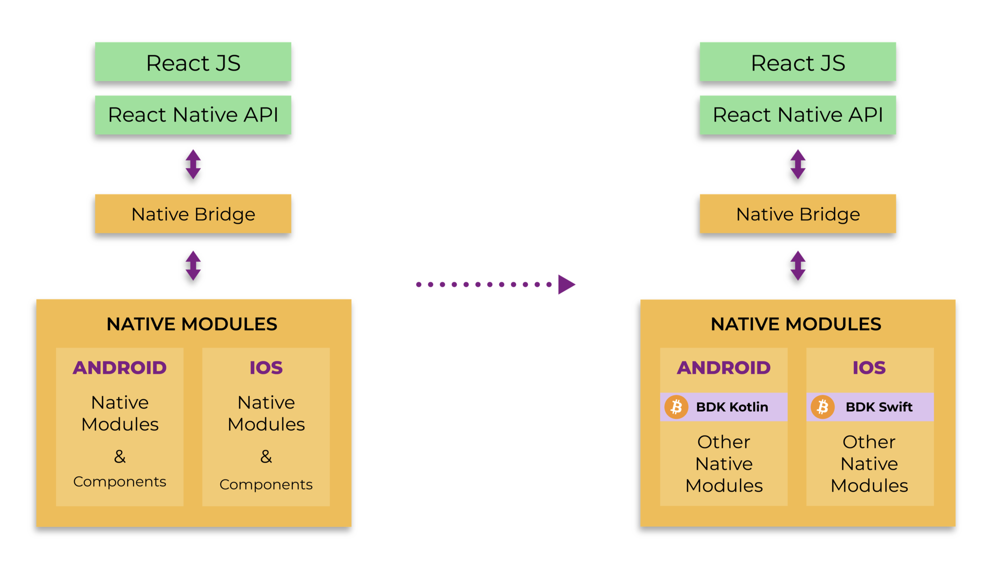
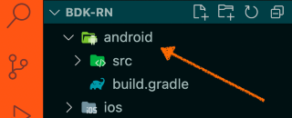

The **BitcoinDevkit**'s **React Native** version (`bdk-rn`) makes it easy to develop bitcoin applications for both Android and IOS mobile platforms. Using `bdk-rn` knowledge of the underlying bitcoin and bdk api or rust is not required and using `bdk-rn` is similar to using any other RN module. The goal is **Rapid Bitcoin Application Development** by doing the heavy lifting in advance and providing a reusable package for other developers to use. Developers simply install using using `yarn add` and start using it in a React Native Project. The native code, rust lang implementation, confugurations any other details are all taken care of by `bdk-rn`.

This article is **NOT a guide on how to use bdk-rn** to build a bitcoin Application, rather this is an insight into how `bdk-rn` was developed. For help on how to use `bdk-rn` to develop a bitcoin Wallet or Application please refer to the user guide in the readme on github: https://github.com/LtbLightning/bdk-rn#usage. There will be `how to guides` published shortly on getting started with `bdk-rn`.

## React Native Architecture

At a high level, RN consists of the UI front which is essentally JavaScript which interacts with the native IOS and Android platforms over a bridge. When communicating over the bridge values from JS are converted to native and vice versa.

The native part of RN  consists of Android as well as IOS modules and components. The Android and IOS sections are full fledged native projects which interact with the JS side over the native bridge. A RN project has all the build configuraiton required to build both Android and IOS projects.

For the purpose of making `bdk-rn`, `bdk-kotlin` is used as the native Android module and `bdk-swift` as native IOS module. These are configured and wrapped in a RN Project as part of the platform specific native modules within the RN Project. This RN Project is then built to be a reusable React Native module.



## Native Integration


In order to communicate to native modules on Android and IOS, React Native provides React Context API for Java/Kotlin as well as Swift. React Context API are used to build the interface to the native bridge allowing communication from JS to native modules.

bdk-rn uses React Context API plus some native code to wrap and enhance bdk-kotlin and bdk-swift APIs. The native code calls and interacts with the Android and IOS native modules which interface with the underlying mobile platform.


## Android Module

We will go into the details of how the BDK Android Module is integrated, similar steps are done for IOS as well.

Starting off with a basic RN project. This project will be enhanced with bdk-kotlin and bdk-swift binaries and native code. For now lets go into the details for Android, IOS has similar steps to be done.

The Android native project is located under the root project folder.




Here we need to add a dependency in `build.gradle` for bdk-kotlin's android native binary. This will enable bdk-kotlin to be downloaded and available as one of the native modules.

```javascript
// File: build.gradle

repositories {
    mavenCentral()
}

dependencies {
    //noinspection GradleDynamicVersion
    implementation 'com.facebook.react:react-native:+'

    // bitcoindevkit
    implementation 'org.bitcoindevkit:bdk-android:0.7.1'
}
```

We will create an Android native module which will interact with `bdk-android`. 
This is done by adding a new Kotlin file named `BdkRnModule.kt` inside `android/app/src/main/java/com/bdkrn/` folder

This will be the native code file for bdk-rn module.Here a new class will be created to encapsulate the interaction with  bitcoindevkit's android native binary.

```kotlin
// File: BdkRnModule.kt

import android.annotation.SuppressLint
import android.util.Log
import com.facebook.react.bridge.Arguments
import com.facebook.react.bridge.Promise as Result
```

`org.bitcoindevkit` will also need to be imported here

```kotlin
import org.bitcoindevkit.Wallet as BdkWallet
```

To use React Context API `com.facebook.react.bridge.*` also needs to be imported

```kotlin
import com.facebook.react.bridge.*
```

A new class needs to be defined here which will implement the React Context API

```kotlin
class BdkRnModule(reactContext: ReactApplicationContext) :
	ReactContextBaseJavaModule(reactContext) {
      override fun getName() = "BdkRnModule"
  }
```

With the base imports and class defined, we can start writing methods.
This will demonstrate how bdk native module will be called and how values will be returned to JS over the native bridge

Lets create a method that can be called from JaveScript, to do so we use the `@ReactMethod` directive which is part of the React Context API. This will expose the method so that it can be called from JavaScript.

```kotlin
@ReactMethod
fun createWallet(result: Promise) {
  
}
```

We need one more file to complete our basic native framework. A new kotlin file, `BdkRnPackage.kt` is required to package all our native code into a new android module. This can be done by adding the following code:

```kotlin
// File: BdkRnPackage.kt

import com.facebook.react.ReactPackage
import com.facebook.react.bridge.NativeModule
import com.facebook.react.bridge.ReactApplicationContext
import com.facebook.react.uimanager.ViewManager

class BdkRnPackage : ReactPackage {

    override fun createNativeModules(reactContext: ReactApplicationContext):
            MutableList<NativeModule> {
        return mutableListOf(BdkRnModule(reactContext))
    }
}

```

Now lets add code for creating a wallet in BdkRnModule.kt

The methods used here are for bdk-kotlin and available in the bdk-kotlin documentation.

We first create a key info object

```kotlin
// File: BdkRnModule.kt

@ReactMethod
fun createWallet(result: Promise) {
  // Create key info with a new mnemonic
  val keys: ExtendedKeyInfo = generateExtendedKey(
        Network.TESTNET,
        WordCount.WORDS12,
        ""
  )
  
  // more code to follow...
  // create descriptor and change descriptor
  // create databaseConfig and blockchainconfig
  // create wallet
  
}
```

Then key info used to create a wallet descriptor and change descriptor:

```kotlin
val descriptor: String = "wpkh(" + keys.xprv + "/84'/1'/0'/0/*)"

val changeDescriptor: String = descriptor.replace("/84'/1'/0'/0/*","/84'/1'/0'/1/*")
```

To create a wallet with bdk we need to specify wallet descriptor, network, a database config, blockchaincofig. We intend to use bitcoin testnet and want to use default memory for data. For bitcoin node we will use a public electrum server. We will need to define these parameters to create a wallet.

```kotlin
val network = `Network.TESTNET`
val databaseConfig = DatabaseConfig.Memory
blockchainConfig =
      BlockchainConfig.Electrum(
          ElectrumConfig("ssl://electrum.blockstream.info:60002", null, 5u, null, 10u)
      )
```

Once done we can use these parameters to create a bdk wallet using the native android bdk library:

```kotlin
var wallet: BdkWallet = BdkWallet(
          descriptor,
          changeDescriptor,
          setNetwork(network),
          databaseConfig,
          config
)
```

Once we have a wallet initialised, we can call methods on it to sync, generate a new address and to get balance 

```kotlin
wallet.sync(ProgressLog, maxAddress)

wallet.getNewAddress()

wallet.getBalance().toLong()
```

To return a value from the native android code to React Native’s Javascript side over the JS Native bridge we will use `com.facebook.react.bridge.Promise`. To return balance information to JS, the folloiwng code can be used

```kotlin
val balance: String = wallet.getBalance().toLong()
result.resolve(balance)
```

At this point  we have an Android native module and it can be invoked from JS by calling createWallet. if the wallet is created correctly it will return the balance.

This project can be imported into any RN project to reuse the defined methods without the need to carry out the setup described above.

```javascript
// any js file in React Native
import BdkRn from 'bdk-rn';

// create a wallet and retrieve balance
const balance = await BdkRn.createWallet();
console.log({ balance })

```

The actual bdk-rn module has organised the native code into granular methods for different stages of creating a wallet and for different interactions with the wallet, like generating seeds, creating wallet for different network, creating descriptors, creating or restoring wallet, fetching balance, fetching transactions  and many other methods. Please refer:[https://github.com/LtbLightning/bdk-rn#library-api](https://github.com/LtbLightning/bdk-rn#library-api) The set of APIs available will grow in the near future as more APIs will get added. This article can also be used as a guide to add new methods to the existing bdk-rn project.

The objective of `bdk-rn` is to enable React Native developers to quickly start developing applications without the need to package BDK as described above. This article can also be used as a guide to add new methods to the existing bdk-rn project.

Be on the lookout for user guides and tutorials on how to build bitcoin applications using `bdk-rn` and `bdk-flutter`.

## References

Creating native modules for Android and IOS: [https://reactnative.dev/docs/native-modules-intro](https://reactnative.dev/docs/native-modules-intro)

React Native Architecture: [https://formidable.com/blog/2019/react-codegen-part-1/](https://formidable.com/blog/2019/react-codegen-part-1/)

BDK-Android API: [https://bitcoindevkit.org/bdk-jvm/bdk-jvm/org.bitcoindevkit/index.html](https://bitcoindevkit.org/bdk-jvm/bdk-jvm/org.bitcoindevkit/index.html)

BDK-RN: [https://github.com/LtbLightning/bdk-rn](https://github.com/LtbLightning/bdk-rn)

## Feedback

The best way to give feedback on this would be to comment on the [pull request](https://github.com/bitcoindevkit/bitcoindevkit.org/pull/106) for this blog post.
Thanks in advance.
