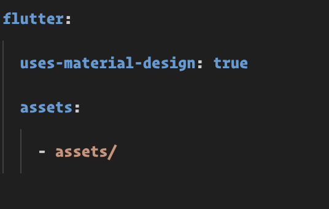
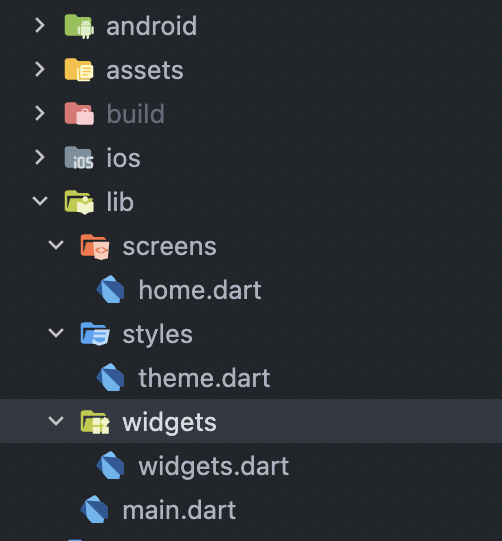
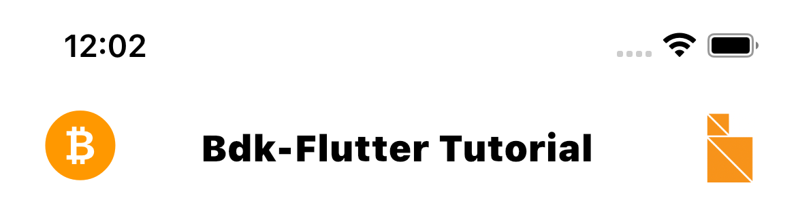
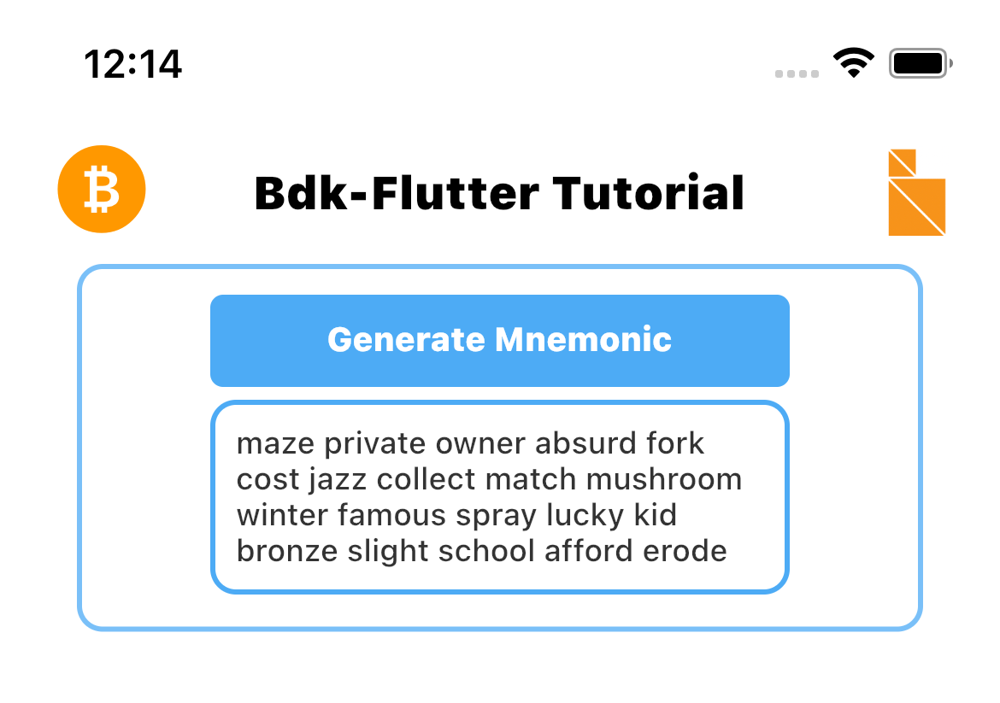
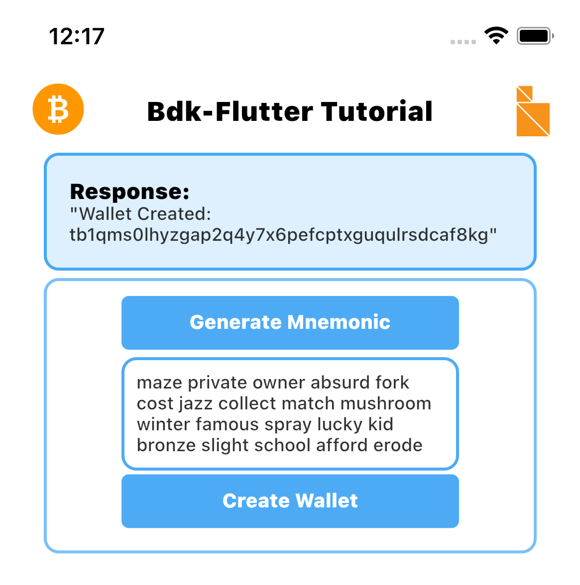
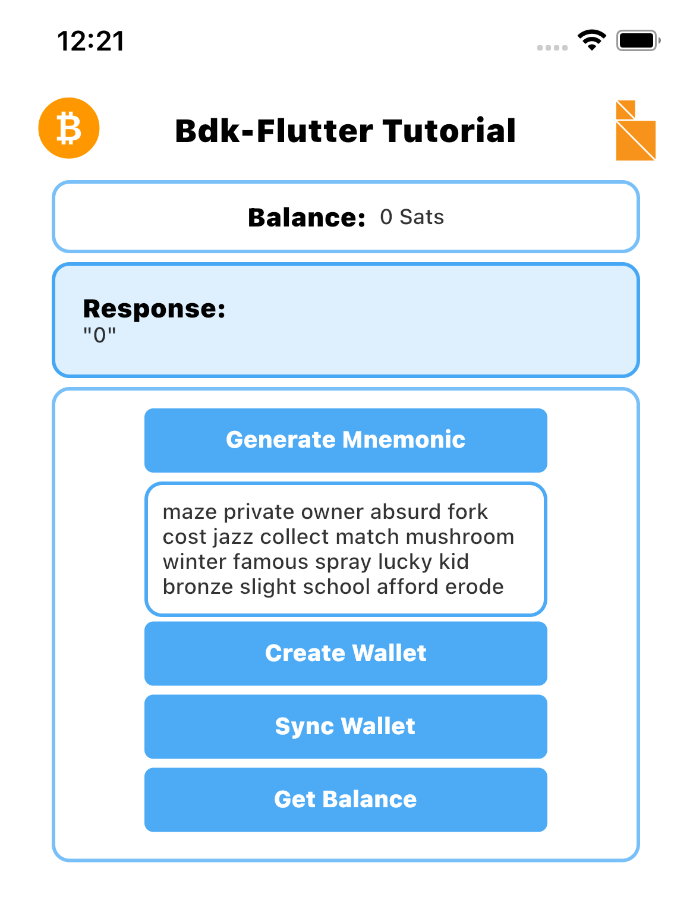
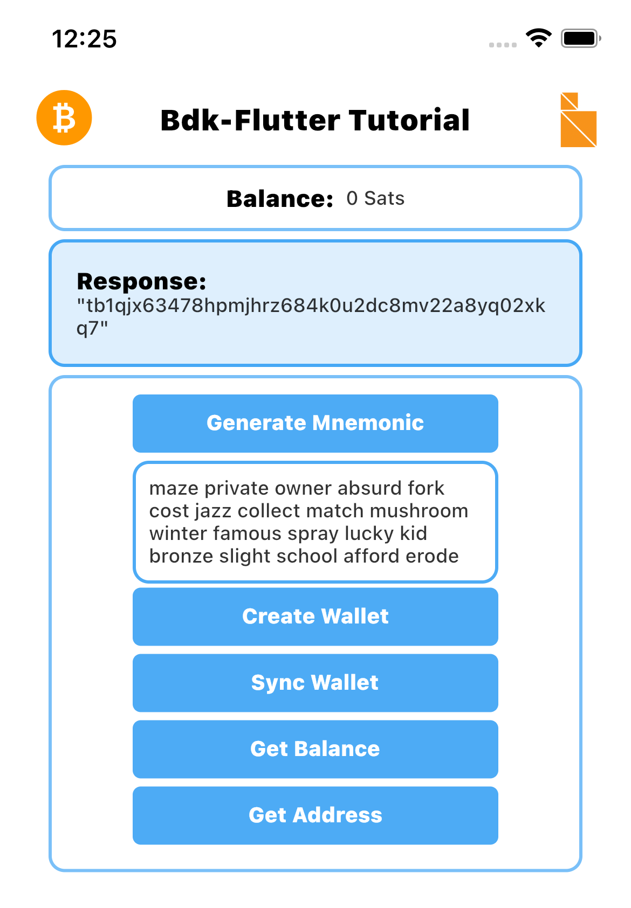
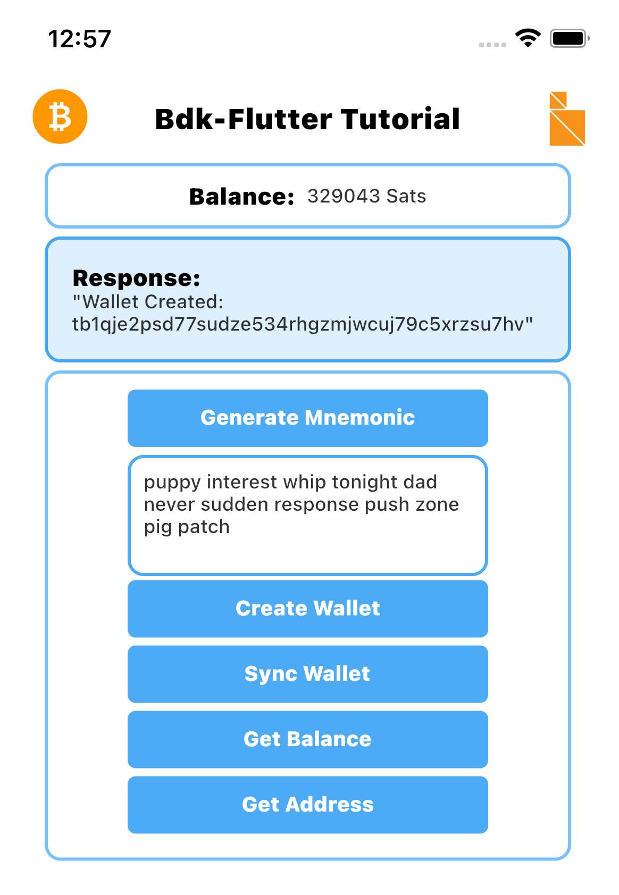
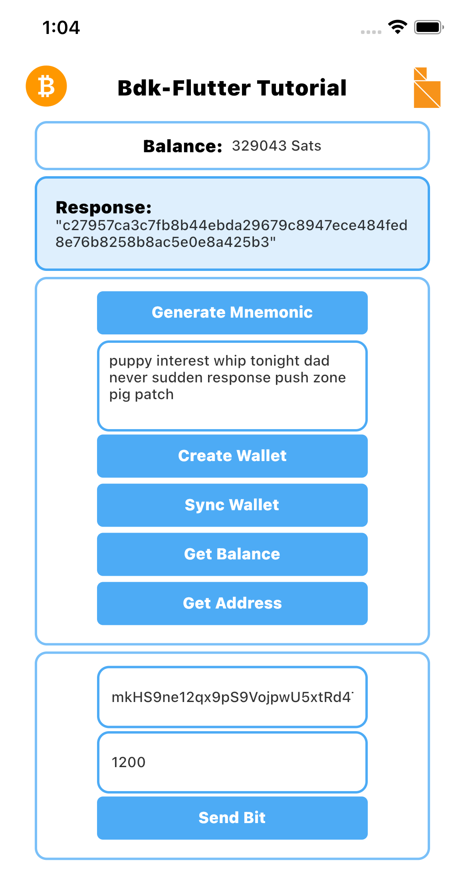

## Introduction

`bdk-flutter` is the **Bitcoin Dev kit**'s **Flutter** library which enables building bitcoin applications for Android and iOS mobile platforms. Using `bdk-flutter` is similar to using any other Flutter module. Just do `flutter pub add bdk_flutter` and you are ready to code! This is the first tutorial on how to use `bdk-flutter`, more coming soon, make sure to [follow](https://twitter.com/BitcoinZavior) to be notified of new ones. There will also be a **`bdk-flutter`** focused Livestream on [Twitch](https://www.twitch.tv/bitcoindevelopers) on the Bitcoin Developers [YouTube Channel](https://www.youtube.com/channel/UCUq_ZdezVWKPvkWRicAYxLA/videos) so make sure to subscribe.

This tutorial will explore `bdk-flutter` usage and the API it provides. This guide will walk through the development process and code for making a bitcoin application. The bitcoin application we create will be a non-custodial HD Wallet. The application will have the functionality to create a new wallet or restore from a known mnemonic seed phrase. This application will also be able to interact with the bitcoin network to sync UTXOs from new blocks and broadcast transactions.

The tutorial will focus on bitcoin concepts and `bdk-flutter` API. So it will gloss over Flutter and Dart. If you are interested in learning more about Flutter and Dart please refer to the Flutter [learning portal](https://flutter.dev/learn). The code for this tutorial is available on the [LtbLightning GitHub](https://github.com/LtbLightning/bdk-flutter-quickstart)


### Prerequisites

To use `bdk-flutter` in a Flutter App, a Flutter development environment is required. Please refer to resources out there on the internet if you need to set this up, here is one of many good resources to guide you on [environment setup](https://docs.flutter.dev/get-started/install)

### Bitcoin Basics

The bitcoin concepts used in this blog post are detailed and explained very well in external bitcoin resources. Here are some links for reference:

[Mastering Bitcoin(HD Wallet chapter)](https://github.com/bitcoinbook/bitcoinbook/blob/develop/ch04.asciidoc)

[Bitcoin Output Descriptors from bitcoin GitHub](https://github.com/bitcoin/bitcoin/blob/master/doc/descriptors.md)

Now let's jump into Bitcoin Dev Kit

## Bitcoin Dev Kit and bdk-flutter

`bdk-flutter` is **Bitcoin Dev kit**'s **Flutter** library for building Bitcoin apps in **Flutter**.
It encapsulates all of the low-level APIs and methods for BDK and exposes them in a Flutter context. To use BDK in Flutter apps only the `bdk-flutter` module is required. `bdk-flutter` can be used like any other Flutter library and is available on [pub.dev](https://pub.dev/packages/bdk_flutter)

## Getting Started

Although we won't delve deep into Flutter we will focus more on bitcoin and `bdk-flutter`, however, some rudimentary Flutter setup is required, especially a basic Flutter app to add our code.

start by creating a new Flutter project.

`flutter create bdk-flutter-quickstart`

Once done let's `cd` into the new project directory and run the basic Flutter app that's created

```shell
cd bdk-flutter-quickstart
flutter run
```

This should start building the app and then launch the app in a simulator. So far we have created a basic Flutter project if this doesn't work then refer to the Flutter development setup guide to troubleshoot.

 

## Setting up Flutter app structure

Let's set up a very basic app structure. Let's create an `assets` folder in the project root and then add new folders `widgets`, `screens`, and `styles` inside the existing `lib` folder.

Paste the following code in your `pubspec.yaml` file, assets section.

    - assets/

Please make sure your assets section looks like the screenshot below.


Once done let's run a `get` command from the pub tool commands, this will get all the required dependencies for our project.

```shell
flutter pub get
```

To make this quick you can download the theme, styled widgets and images used in the tutorial from the repository. The `theme.dart` file has the theme we will use and this can be taken from [here](https://github.com/LtbLightning/bdk-flutter-quickstart/blob/master/lib/styles/theme.dart) and moved to the styles folder. The `widgets.dart` file has the styled widgets we will use and these can be taken from [here](https://github.com/LtbLightning/bdk-flutter-quickstart/blob/master/lib/widgets/widgets.dart) and moved to the widgets folder. The image assets can be taken from [here](https://github.com/LtbLightning/bdk-flutter-quickstart/tree/master/assets)  Alternatively, you can write your theme, widgets and use your images if you intend to style the app differently.

In addition to the the theme, widgets and assets. We also need to create a `screens` folder and create a `home.dart` file inside it, this will be where most of the code will be added.

Once done the file structure should look like this:



<br/>Locate `main.dart` in the project root, this will have the default code added by `flutter create`, let's delete all contents of `main.dart` and replace it with the following code to use `home.dart` as our main screen. This will probably crash the app but that's fine, it will be up and running once we add code to `home.dart` in the next few steps

```dart
// main.dart

import 'package:bdk_flutter_quickstart/screens/home.dart';
import 'package:bdk_flutter_quickstart/styles/theme.dart';
import 'package:flutter/material.dart';

void main() {
 runApp(const MyApp());
}

class MyApp extends StatelessWidget {
  const MyApp({Key? key}) : super(key: key);

  // This widget is the root of your application.
    @override
    Widget build(BuildContext context) {
      return MaterialApp(
        debugShowCheckedModeBanner: false,
        title: 'BDK-FLUTTER TUTORIAL',
        theme: theme(),
        home: const Home(),
      );
    }
}
```

## Installing `bdk-flutter`

With the Flutter project in place, we can now add `bdk-flutter` using `flutter pub add`.

```shell
flutter pub add bdk_flutter
```

This will add a line like this to your package's `pubspec.yaml` and this will also run an implicit flutter pub get to download `bdk-flutter` from `pub.dev`:

```shell
dependencies:
  bdk_flutter: ^0.28.2
```

## Configuring

Make sure your app meets the following requirements for using `bdk-flutter`

**Android**

MinSdkVersion : API 23 or higher.

**IOS**

Deployment target: iOS 12.0 or greater.

Locate your Podfile in the ios folder of your project and paste the following code at the beginning

```
platform :ios, '12.0'
```

After changing the deployment target in your project's `PodFile`, let's use the following `command` to install pod dependencies for iOS.

```shell
cd ios && pod install && cd ..
```

Once done, bdk-flutter is installed and configured and ready to be used in our **bdk-flutter-quickstart** App.

## Importing `bdk-flutter`

Locate `home.dart` which we added in the setup section and import `bdk-flutter` at the top of the file. Create a stateful widget called `Home`

```dart
// screens/home.dart

import 'package:bdk_flutter/bdk_flutter.dart';

 class Home extends StatefulWidget {
  const Home({Key? key}) : super(key: key);

  @override
  State<Home> createState() => _HomeState();
}

class _HomeState extends State<Home> {
  TextEditingController mnemonic = TextEditingController();
  @override
  Widget build(BuildContext context) {
    return  Container();
  }
}
```

Before we start using `bdk-flutter` let's add some additional imports and also import styles, to create a basic layout to build our home screen

```dart
// screens/home.dart

import 'package:bdk_flutter/bdk_flutter.dart';
import 'package:bdk_flutter_quickstart/widgets/widgets.dart';
import 'package:flutter/cupertino.dart';
import 'package:flutter/material.dart';

class Home extends StatefulWidget {
  const Home({Key? key}) : super(key: key);

  @override
  State<Home> createState() => _HomeState();
}

class _HomeState extends State<Home> {

  @override
  Widget build(BuildContext context) {
    return Scaffold(
        resizeToAvoidBottomInset: true,
        backgroundColor: Colors.white,
        /* AppBar */
        appBar: buildAppBar(context),
        body:  SingleChildScrollView(
          child: Container(
            padding: const EdgeInsets.symmetric(horizontal: 30),
            child: Column(
              children: const [
                /* Balance */

                /* Create Wallet */

                /* Send Transaction */
              ],
            ),
          ),
        ));
  }
}
```

We now have an app title section and a structure to hold the rest of our app components.



## Calling bdk-flutter methods

To call all methods properly from the `bdk-flutter` package, first, we need to create state variables to store `Wallet` and `Blockchain` objects.

Here we use the late keyword to declare both `Wallet` and `Blockchain`. These are non-nullable variables that are initialized after the declaration.

```dart
import 'package:bdk_flutter/bdk_flutter.dart';

late Wallet wallet;
late Blockchain blockchain;
```

The first step in creating a non-custodial bitcoin app is creating a mnemonic seed phrase for the wallet.

`bdk-flutter` provides a `Mnemonic` class to create a `Mnemonic`. The `create` method is a named constructor and can be used to create a mnemonic, it takes `WordCount` as its required parameter.

```dart
var res = await Mnemonic.create(WordCount.Words12);
```

We can generate a mnemonic of longer length by passing in a wordCount argument of required length.

To create a mnemonic with a `WordCount` of 18 words, we can use `(WordCount.Words18)`
Refer to the API docs on [pub.dev](https://pub.dev/documentation/bdk_flutter/latest/bdk_flutter/bdk_flutter-library.html) for more details.

```dart
  var res = await Mnemonic.create(WordCount.Words18);
// here response is saved as a 'Mnemonic' object
```

In order to use this in our Flutter app, we want a button that will generate a mnemonic when clicked, and a text input box to show the generated mnemonic. Let's first create a `TextEditingController` for the `mnemonic` textfield to store the mnemonic, and an internal `generateMnemonicHandler` method which can be called on button click. We will also need a button that will call the internal `generateMnemonicHandler` method when clicked. Adding the following code achieves all of this.

```dart
class Home extends StatefulWidget {
  const Home({Key? key}) : super(key: key);

  @override
  State<Home> createState() => _HomeState();
 }

class _HomeState extends State<Home> {
  late Wallet wallet;
  late Blockchain blockchain;
  TextEditingController mnemonic = TextEditingController();

  Future<void> generateMnemonicHandler() async {
   var res = await Mnemonic.create(WordCount.Words12);
    setState(() {
     mnemonic.text = res.asString();
    });
  }
  @override
  Widget build(BuildContext context) {
    return Scaffold(
        resizeToAvoidBottomInset: true,
        backgroundColor: Colors.white,
        /* Header */
        appBar: buildAppBar(context),
        body:  SingleChildScrollView(
          child: Container(
            padding: const EdgeInsets.symmetric(horizontal: 30),
            child: Column(
              children: [
                 /* Balance */

                   /* Result */


                  /* Create Wallet */
                 StyledContainer(
                    child: Column(
                        mainAxisAlignment: MainAxisAlignment.start,
                        crossAxisAlignment: CrossAxisAlignment.center,
                        children: [
                         SubmitButton(
                              text: "Generate Mnemonic",
                              callback: () async {
                                await  generateMnemonicHandler();
                              }
                          ),
                          TextFieldContainer(
                            child: TextFormField(
                                controller: mnemonic,
                                style: Theme.of(context).textTheme.bodyText1,
                                keyboardType: TextInputType.multiline,
                                maxLines: 5,
                                decoration: const InputDecoration(
                                    hintText: "Enter your mnemonic")),
                          ),
                        ]
                      )
                   ),
                /* Send Transaction Buttons */

              ],
            ),
          ),
        ));
  }
}
```

Now we need to add a component to display the output of our method calls and this will also need a `displayText` variable to track our method call response. To achieve this add the following code.

```dart
// screens/home.dart

// add this as another state variable under mnemonic
String? displayText;

// modify the generateMnemonicHandler method to also set mnemonic as displayText

 Future<void> generateMnemonicHandler() async {
    var res = await Mnemonic.create(WordCount.Words12);
    setState(() {
      mnemonic.text = res.asString();
      displayText = res.asString();
    });
  }
```

and finally, let's add the component to display the output under ` /* Result */`

```dart
// screens/home.dart

  /* Result */
  // display the component only if displayText has a value
   ResponseContainer(text:displayText ?? "No Response"),
```

We should now have a working "Generate Mnemonic" button that displays the new mnemonic



A quick recap, we added a button to call a click handler (`generateMnemonicHandler`) which calls `generateMnemonic` API of `bdk-flutter`. The click handler also sets the state for the app and also updates the `displayText` variable to display the output of the call in the display section. We will follow this pattern for the remaining calls to `bdk-flutter`.

## Creating a wallet

Before moving on to creating a wallet, let's add a section at the top to display the balance of the wallet.

To display the balance we will need a state variable to store the balance and a display component to display it. We will also be creating a receive address for the wallet so a state variable will be required for the address as well.

Under the `mnemonic` and `displayText` state variables, let's add one for `balance` and one for `address`

```dart
class _HomeState extends State<Home> {
  TextEditingController mnemonic = TextEditingController();
  String? displayText;
  String? balance;
  String? address;
```

Just below `/* Balance */` and above `/* Result */` add the following UI components to display the balance. We only want to show the balance when it has a value so we will use a null-aware operator `??` for a quick `null` check and use `0` in case of a `null` value.

```dart
         /* Balance */
         BalanceContainer(
                  text: "${balance ?? "0"} Sats",
                ),
        /* Result */
```

`bdk_flutter` creates a wallet using output descriptors which define the derivation path to derive addresses and sign transactions. More about output descriptors [here](https://github.com/bitcoin/bitcoin/blob/master/doc/descriptors.md). Before creating the `Wallet` we need to create a `descriptor` object which will be used to generate receive addresses and a `changeDescriptor` object to to create change addresses to collect from outgoing transactions.

`bdk_flutter`'s `Descriptor` class has a number of descriptor templates that will help you create a simple wallet.

Let's add some code to create a simple `wpkh` descriptor object by using the `BIP84` template. This template will create a descriptor in the format `wpkh(key/84'/{0,1}'/0'/{0,1}/*)`

This descriptor will create receive (`KeyChainKind.External`) and change descriptor (` KeyChainKind.Internal`) for a specified mnemonic.

```dart
Future<List<Descriptor>> getDescriptors(String mnemonic) async {
    final descriptors = <Descriptor>[];
    try {
      for (var e in [KeychainKind.External, KeychainKind.Internal]) {
        final mnemonicObj = await Mnemonic.fromString(mnemonic);
        final descriptorSecretKey = await DescriptorSecretKey.create(
          network: Network.Testnet,
          mnemonic: mnemonicObj,
        );
        final descriptor = await Descriptor.newBip84(
            secretKey: descriptorSecretKey, 
            network: Network.Testnet, 
            keychain: e,
        );
        descriptors.add(descriptor);
      }
      return descriptors;
    } on Exception catch (e) {
      setState(() {
        displayText = "Error : ${e.toString()}";
      });
      rethrow;
    }
  }

```

Under the `address` state variable, let's add a state variable called `wallet` of the type `Wallet` for saving the bitcoin wallet.

To create a wallet with `bdk-flutter` call the `create` constructor with `descriptor`, `changeDescriptor` `network`, and the `databaseConfig`. For database, we can use memory as the database by specifying `DatabaseConfig.memory()`
Following our pattern of a button, click handler and bdk-flutter API call, Let's add an internal method which will serve as the click handler for the "Create Wallet" button. We want to see the output of this call so let's use `setState()` to set the `wallet` object created and the `displayText` variable with the wallet's first receive address.

```dart
  Future<void> createOrRestoreWallet(
      String mnemonic, Network network, String? password) async {
    try {
      final descriptors = await getDescriptors(mnemonic);
      final res = await Wallet.create(
          descriptor: descriptors[0],
          changeDescriptor: descriptors[1],
          network: network,
          databaseConfig: const DatabaseConfig.memory());
      var addressInfo = await res.getAddress(addressIndex: const AddressIndex());
      setState(() {
        address = addressInfo.address;
        wallet = res;
        displayText = "Wallet Created: $address";
      });
    } on Exception catch (e) {
      setState(() {
        displayText = "Error: ${e.toString()}";
      });
    }
  }
```

A new button will be required to call `createOrRestoreWallet()`

Let's add a new button just below the mnemonic `TextFieldContainer`

```dart
SubmitButton(
            text: "Create Wallet",
            callback: () async {
              await createOrRestoreWallet(
                mnemonic.text, 
                Network.Testnet,
               "password",
              );
          },
        ),
```

The response returned by `create()` is a `Wallet` object.

The App should now be creating a wallet when we click **Create Mnemonic** followed by **Create Wallet**.



Before going forward, we need to create a `Blockchain` object as well. The Blockchain object will encapsulate the bitcoin node configuration which the wallet will use for syncing blocks and broadcasting transactions.

Let's add an internal method to create and initialize the `Blockchain` object.

```dart
  Future<void> blockchainInit() async {
    blockchain = await Blockchain.create(
        config: BlockchainConfig.electrum(
            config: ElectrumConfig(
                  stopGap: 10,
                  timeout: 5,
                  retry: 5,
                  url: "ssl://electrum.blockstream.info:60002",
                  validateDomain: false)));
  }
```

Here we are initializing the `late` non-nullable `blockchain` variable, by calling the named constructor `create`, which takes a `BlockchainConfig` object.
The bitcoin node specified is an Electrum node and we are specifying the url for Blockstream's public Electrum Testnet servers over SSL.

After creating the `blockchainInit()` method, call it from `createOrRestoreWallet()`, so the `blockchain` variable gets initialized before the `wallet` is created.

Include the following line of code inside `createOrRestoreWallet() ` just before calling Wallet.create().

```dart
....
  await blockchainInit();
  final res = await Wallet.create(
 .....
```

**blockChainConfig**: BlockchainConfig is an enum that has 3 values, `BlockchainConfig.electrum` for [`electrum`](https://github.com/romanz/electrs) ,`BlockchainConfig.esplora` for [`esplora`](https://github.com/Blockstream/esplora) and `BlockchainConfig.rpc` .

`BlockchainConfig.electrum`, `BlockchainConfig.rpc` & `BlockchainConfig.esplora` has `ElectrumConfig` object, `RpcConfig` object and `EsploraConfig` object, respectively as its parameter.

**ElectrumConfig**: This is the object type of `BlockchainConfig.electrum`'s config that takes a timeout, retry & url as its required parameter.

**EsploraConfig**: This is the object type of `BlockchainConfig.esplora`'s config that takes baseUrl & stopGap as its required parameter.

**RpcConfig**: This is the object type of `BlockchainConfig.rpc`'s config that takes url, network, & walletName as its required parameter. If `Rpc Blockchain` has its authentication values inside a cookie file, please pass in cookie path as authCookie parameter, or you can pass in rpc username and password using `UserPass` class.

Refer to the readme for a complete list of options for [createWallet()](https://github.com/LtbLightning/bdk-flutter#createwallet)

## UTXOs and balance

With the `Wallet` and `Blockchain` created, we can now add methods to sync UTXOs and compute balance.

`Wallet` has a `sync` method to sync all UTXOs belonging to the wallet using the `Blockchain` object. Once the wallet sync is complete balance is computed and `getBalance` can fetch the balance.

Earlier we have already added a variable for `balance`. Now we will add buttons to call `sync` and `getBalance`. Just below the Create Wallet button let's add two buttons as follows:

```dart
    SubmitButton( text: "Sync Wallet",
                  callback: () async { await syncWallet(); },
                ),

    SubmitButton( callback: () async { await getBalance(); },
                  text: "Get Balance",
                ),
```

Let's add two internal functions for syncing UTXOs and compute balance.

```dart
   Future<void> getBalance() async {
    final balanceObj = await wallet.getBalance();
    final res = "Total Balance: ${balanceObj.total.toString()}";
    print(res);
    setState(() {
      balance = balanceObj.total.toString();
      displayText = res;
    });
  }

  Future<void> syncWallet() async {
    wallet.sync(blockchain);
  }

```

We should now be able to create a wallet, sync UTXOs, and get the balance



We can use a public testnet faucet to send testnet coins to the wallet and check that the UTXO sync and balance fetch are working correctly. Before we do that add one more method to generate a new address we can then use this address to get testnet coins from a faucet.

Let's use the `address` variable that was created before for this, we need to add a button for **Get Address** and an internal function to call `Wallet` and create a new address. Let's do the following

Add a new `getNewAddress` function below the `syncWallet()` function:

```dart
 Future<void> getNewAddress() async {
    final res = await wallet.getAddress(addressIndex: const AddressIndex());
    setState(() {
      displayText = res.address;
      address = res.address;
    });
  }
```

And a **Get Address** button below the existing **Get Balance** button:

```dart
  SubmitButton(
    callback: () async { await getNewAddress(); },
    text: "Get Address"
  ),
```

We should now have the following, and **Get Address** will be able to display a new address.



Now that we are able to generate a receive address we can get some testnet bitcoin from one of the public [testnet faucets](https://coinfaucet.eu/en/btc-testnet/)

After we send and after the transaction is confirmed we will need to sync the wallet before we can see the new balance from the received transaction.

## Restoring a wallet

The `create` method creates a wallet using a `mnemonic`, to restore we can use the same method, we won't need to call `generateMnemonic` as we will already have a `mnemonic` to restore with.

This text field below the `Generate Mnemonic` button will also display the mnemonic variable if we click Generate Mnemonic' button. The generated mnemonic will show up in the text field. We can overwrite it with our mnemonic and doing so will also overwrite the mnemonic state variable. This way the mnemonic displayed will be the one used to create the wallet.

We can now use our mnemonic and use it to restore a wallet. This will come in handy if we have a wallet with testnet bitcoin as these are hard to come by.



## Sending bitcoin

We are now able to receive bitcoin, now its time to add functionality to send a bitcoin transaction.

For making a successful bitcoin transaction `bdk-flutter` utilizes a couple of methods. A new unsigned transaction can be created by using TxBuilder](https://github.com/LtbLightning/bdk-flutter#quicksend).

First, we have to initialize the `TxBuilder` object and call the `addRecipient()` method.
`addRecipient()` takes a `Script` object and the transaction `amount`.

```dart
  final res = await txBuilder.addRecipient(script, amount);
```

We can create the`Script` object by using the `Address` class, by specifying the recipient address.

```dart
  final address = await Address.create(address: addressStr);
  final script = await address.scriptPubKey();
  final res = await txBuilder.addRecipient(script, amount);
```

We can create a `psbt` object by calling the `finish()` method using the response object from `addRecipient()` method.

```dart
 final txBuilder = TxBuilder();
    final address = await Address.create(address: addressStr);
    final script = await address.scriptPubKey();
    final psbt = await txBuilder
        .addRecipient(script, amount)
        .feeRate(1.0)
        .finish(wallet);
```

This `psbt` can be signed later with [sign()](https://github.com/LtbLightning/bdk-flutter#signtx) method from the `Wallet` and broadcast using [broadcast()](https://github.com/LtbLightning/bdk-flutter#broadcasttx) from the `Blockchain` .

We will need textfield controllers for the recipient address, amount, and for transaction, these can be added below our existing variable for `mnemonic`

```dart
  TextEditingController recipientAddress = TextEditingController();
  TextEditingController amount = TextEditingController();
```

Let's make an internal function to send a bitcoin transaction, using `Wallet`, `Blockchain` and `TxBuilder `.

```dart
  Future<void> sendTx(String addressStr, int amount) async {
    try {
      final txBuilder = TxBuilder();
      final address = await Address.create(address: addressStr);
      final script = await address.scriptPubKey();
      final txBuilderResult = await txBuilder
          .addRecipient(script, amount)
          .feeRate(1.0)
          .finish(wallet);
      final sbt = await wallet.sign(psbt: txBuilderResult.psbt);
      final tx = await sbt.extractTx();
      await blockchain.broadcast(tx);
      setState(() {
        displayText = "Successfully broadcast $amount Sats to $addressStr";
      });
    } on Exception catch (e) {
      setState(() {
        displayText = "Error: ${e.toString()}";
      });
    }
  }

```

Add a new section for send transaction functionality. We will need a `form`, a `TextFormField` for the receiver address and a `TextFormField` for the amount to send. We will also need a button to call the `sendTx` function.

Before submitting the form we need to make sure all the input fields are valid, for that purpose, we need to initialize a [`GlobalKey`](https://api.flutter.dev/flutter/widgets/GlobalKey-class.html). This can be added above our `Scaffold`

```dart
final _formKey = GlobalKey<FormState>();
```

Let's add the send transaction section and UI components below `/* Send Transaction */`

```dart
   StyledContainer(
                  child: Form(
                   key: _formKey,
                   child: Column(
                      mainAxisAlignment: MainAxisAlignment.start,
                      crossAxisAlignment: CrossAxisAlignment.center,
                      children: [
                        TextFieldContainer(
                          child: TextFormField(
                            controller: recipientAddress,
                            validator: (value) {
                              if (value == null || value.isEmpty) {
                                return 'Please enter your address';
                              }
                              return null;
                            },
                            style: Theme.of(context).textTheme.bodyText1,
                            decoration: const InputDecoration(
                              hintText: "Enter Address",
                            ),
                          ),
                        ),
                        TextFieldContainer(
                          child: TextFormField(
                            controller: amount,
                            validator: (value) {
                              if (value == null || value.isEmpty) {
                                return 'Please enter the amount';
                              }
                              return null;
                            },
                            keyboardType: TextInputType.number,
                            style: Theme.of(context).textTheme.bodyText1,
                            decoration: const InputDecoration(
                              hintText: "Enter Amount",
                            ),
                          ),
                        ),
                        SubmitButton(
                          text: "Send Bit",
                          callback: () async {
                            if (_formKey.currentState!.validate()) {
                              await sendTx(recipientAddress.text,
                                  int.parse(amount.text));
                            }
                          },
                        )
                      ]
                    ),
                 )
               )

```

We should now be able to send a transaction as long as there is sufficient balance.



## Conclusion

The App we created can be built and distributed for both iOS and Android thus sharing a code base and reducing development time. The development and coding focused on application-level code for use cases and we did not have to code intricate internal bitcoin protocol-level code or bitcoin node interactions, and transactions. UTXOs and sync-related functionalities were also not required. All this was managed by `bdk-flutter` allowing us to focus on the product, functionality, and user journey. This is how `bdk` and `bdk-flutter` intend to make Rapid Bitcoin Application Development possible by allowing product and application developers to focus on what they know best while `bdk` handles bitcoin complexity.

`bdk-flutter` intends to expose functionality and APIs from `bdk` which has a wide variety of APIs with granular details allowing for many interesting use cases to be implemented. `bdk-flutter` and `bdk` are constantly updated and enhanced based on feedback from product teams and developers in the bitcoin community.

Stay tuned for more APIs and enhancements coming to `bdk-flutter` in the near future. Feature and API requests are most welcome. New blogs and tutorials will be published soon for a more in-depth exploration of `bdk-flutter`.

In the meantime keep in touch with the project by following us on [GitHub](https://github.com/LtbLightning/bdk-flutter) and [Twitter](https://twitter.com/BitcoinZavior)

#### References:

- [bdk](https://github.com/bitcoindevkit)
- [bdk-flutter](https://github.com/LtbLightning/bdk-flutter)
- [bdk-flutter-quickstart GitHub Repository](https://github.com/LtbLightning/bdk-flutter-quickstart)
- [Setup Flutter Development Environment](https://docs.flutter.dev/get-started/install)
- [Mastering Bitcoin(HD Wallet chapter)](https://github.com/bitcoinbook/bitcoinbook/blob/develop/ch04.asciidoc)
- [Bitcoin Output Descriptors from bitcoin GitHub](https://github.com/bitcoin/bitcoin/blob/master/doc/descriptors.md)
- Testnet Faucet: [https://coinfaucet.eu/en/btc-testnet/](https://coinfaucet.eu/en/btc-testnet/) or [https://bitcoinfaucet.uo1.net](https://bitcoinfaucet.uo1.net)
