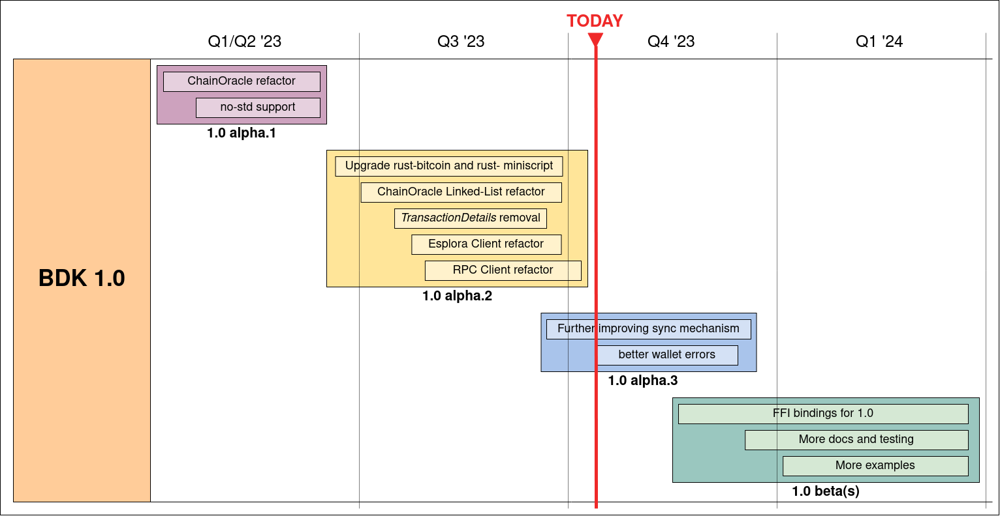

Exciting times are ahead of the development of the Bitcoin Dev Kit, the rust-based set of libraries and tools that allow developers to seamlessly build cross-platform on-chain bitcoin wallets without having to re-implement standard bitcoin data structures, algorithms, and protocols. In the past few months great progress was made to bring new and improved BDK APIs to our users.

As stated in a past [blog post](https://bitcoindevkit.org/blog/road-to-bdk-1/), the BDK team had temporarely frozen new features development, while keeping the maintenance of the 0.x versions ongoing, to focus on developing a new stable API - especially regarding the syncing mechanism, as brilliantly explained in the first [blog post](https://bitcoindevkit.org/blog/bdk-core-pt1/) regarding the new architecture of bdk_core. The goal of this major refactoring is to get to a BDK 1.0 version with a stable wallet API with new crates to manage the low level syncing blockchain data for a modern descriptor-based wallet with popular blockchain backends (e.g. Esplora, Electrum, RPC).

The scope of this blog post is to give rough time estimations for upcoming releases and describe what we expect to be included in each release. We also hope to generate feedback on the features that we are planning to include in the future versions to help us properly prioritize them in a well-defined roadmap. Keep in mind that BDK is a completely Open Source project that depends on a small team of volunteer and grant funded contributors. And as with any software project many factors could dramatically impact the timeline required to deliver quality software. In addition to code, review, and testing from contributors the feedback we get from users will have the most help guideing the projects activities in the right direction.

## Timeline and Activities

The graph below is a rough forcasted timeline for new development. Keep in mind the further the time from the present the higher the uncertainty of the estimations in case of number of contributors and possible changing priorities due to both technical and user requirements. 

Only the macro-activities are listed in the graph and since it is not always easy to understand from the outside what they mean in practice, below you can also find a short description for each of major task (and a link to the relative PR on github when available).

### 1.0 alpha.1 milestone

The `1.0.0-alpha.1` milestone was already published. The main activities it included are:

#### [ChainOracle refactor](https://github.com/bitcoindevkit/bdk/pull/976)

Implementation of a more efficient way to find out whether a specific transaction is in the blockchain or not. Instead of storing the position of a transaction, the new ChainOracle trait stores some information (i.e. block hash and height) of a specific "Anchor" block which allows to verify the presence of the needed txid reducing the amount of queries to be performed on the blockchain source.

#### [no-std support](https://github.com/bitcoindevkit/bdk/pull/894)

No std support was implemented thanks to the new more modular approach to bdk which simplifies such work. Together with this, a fix for the Rust 1.48 version support was made.

### 1.0 alpha.2 milestone

This is the latest released milestone focused on wrapping up the refactoring needed for the internal blockchain APIs. It also adds an innovative new block by block bitcoind RPC blockchain syncing module. Among many small changes, the main activities were:

#### [Upgrade rust-bitcoin to 0.3 and rust-miniscript to 0.10 version](https://github.com/bitcoindevkit/bdk/pull/1023)

The recent update of the rust-bitcoin and rust-miniscript libraries made it necessary for an upgrade also in BDK, which heavily relies on them. This upgrade was also performed on the latest BDK maintenance release (0.29).

#### [ChainOracle Linked-List refactor](https://github.com/bitcoindevkit/bdk/pull/1034)

Implementation of a new way of storing blocks so that an history of "checkpoints" can be stored instead of cloning all the list of blocks, allowing to save significant amounts of data storage.

#### [RPC Client refactor](https://github.com/bitcoindevkit/bdk/pull/1041)

A new blockchain client module, `bitcoind_rpc`, that allows wallets of any size to quickly sync "block by block".

#### [Esplora Client refactor](https://github.com/bitcoindevkit/bdk/pull/1040)

Adjustment of the Esplora backend module due to the new way of storing blocks (see above), with a related new cli example showing off new chain syncing features.

#### [Removal of TransactionDetails from Wallet API](https://github.com/bitcoindevkit/bdk/pull/1048)

Change on the retrieval of details of a transaction such as amounts, fee and fee rate in order to make it directly possible from the Wallet API. 

### 1.0 alpha.3 milestone

This third milestone focuses on wrapping up Wallet API changes in preparation for the 1.0.0 beta release. It is composed by many small changes regarding the following main topics:

#### Better wallet errors

The aim of this is to improve the readibility of different type of errors for the BDK users in order to be able to differentiate better in their own application.

#### Further improving synching mechanism

This includes creating a higher level method for syncing a Wallet using the new mechanisms recently added, improved the conflict resolution of unconfirmed transactions, some small bug fixes on the syncing mechanism and adding further examples for the different methodologies.

### 1.0 beta release

With the alpha.3 milestone underway, the plan is to release a BDK 1.0 beta release before the end of 2023. This BDK 1.0 beta version will provide a stable Wallet API our users can start experimenting with in their own application. During the beta phase the team will continue to add new code examples, documentation and testing. The team will also be updating the BDK-FFI mobile bindings (Kotlin/Android, Swift/iOS, python) to the new BDK 1.0 Wallet APIs (if you are more curious about BDK's general approach to bindings, this [this](https://bitcoindevkit.org/blog/bindings-scope/) blog post). New beta releases will be made as needed to address user feedback.

### 1.0 release

Once all beta user feedback, bug fixes, documentation, testing, and mobile language bindings are complete, the final BDK 1.0 will be ready to release. The purpose of calling this our 1.0 version is to signal to users that the main user facing APIs are stable and will be supported with bug fixes, documentation, and feature enhancements going forward. All projects using pre-1.0 versions of BDK should migrate to this version.

### 1.1 release

Current plans for a 1.0 release are still being developed but include plans to add compact block filter (BIP157/158) support and new electrum client features. No user facing Wallet APIs will be changed for this release, only new features will be added.

### 2.0 release

A new 2.0 release will be needed to upgrade to the next major `rust-bitcoin` and `rust-miniscript` dependency versions. During this milestone we also plan to incorporate the new `rust-miniscript` "planning" module to improve transaction builder usability and the efficiency of coin selection. We will also use this release to enable support for "multi-descriptor" Wallets, similar to how bitcoin core descriptor wallets work.
