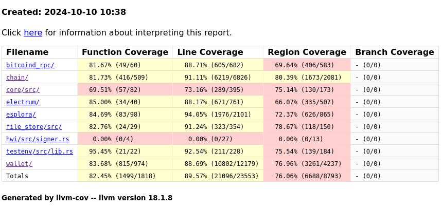

[Spiral](https://spiral.xyz/) hired [Wizardsardine](https://wizardsardine.com/) for 10 days to perform
a (partial) audit of the [BDK wallet library](https://github.com/bitcoindevkit/bdk) (at tag
`v1.0.0-beta.2`).

This audit was focused on the `bdk_chain`, `bdk_electrum`/`bdk_esplora` and `bdk_wallet` crates with
the intention to look for defects which could lead to returning incorrect information to a user
about their wallet or to prevent them from reliably using it under realistic circumstances (e.g. a
crash bug which can be triggered by a third party, or a significant slowdown in performing some
operations).

A threat model I considered interesting for the purpose of this review was that of a server-side
software using BDK to perform Bitcoin tasks and serving its clients through a public API. In this
fairly standard scenario, a crash internal to the BDK library could lead to a Denial of Service for
all users of the application.

From my discussion with the developers of the library, remote Esplora and Electrum servers are
trusted sources of information about the Bitcoin network. A rogue server providing invalid
information is therefore considered out of scope. Likewise, I didn't focus on finding crashes that
can be triggered by a malicious server (although I did report some).

I have used test coverage reports to guide me throughout this audit. I join to this document a full
report of the code coverage of all the unit tests from the library. It's available
[here](https://darosior.github.io/bdk_coverage/unit_tests/coverage/home/darosior/projects/bdk/crates/index.html).



We conducted this audit in three parts. First I carefully inspected the code of each module under
review for logic errors, leveraging the unit test framework. I did not find it necessary to write
and share new unit tests (besides some reproductions, see the details section) since the reviewed
module already have extensive unit test coverage as can be observed from the above report. A second
part of the audit was undertaken by @Pythcoiner (who works with us at Wizardsardine on Liana's QA)
and consisted of manually testing the library, looking for surprising behaviour in corner cases.
Finally, I wrote two fuzz targets (code is shared along with this report):
- The first one exercised the `Wallet` interface under a number of conditions with data generated by
  the fuzzer (apply an update, roundtrip to persistence, or create a transaction, then repeat). It's
  more superfluous as it's general, but is a good way to assert some general invariants (for
  instance "the balance is the same before and after round-tripping to persistence") and checking
  nothing crashes if we just throw random data at the high-level interface.
- The second one specifically targets the reorg logic in `bdk_chain` (the `merge_chains` function).
  Based on the fuzzer's input it creates an initial chain and an updated chain, merges the two, then
  asserts some invariants (it does connect when it should, etc).

BDK is a large project and 10 days is not enough to perform a comprehensive review of the library.
Only the 4 modules I focused on already amount to 15,777 lines of code (without accounting for the
unit test directories). Here is a list of things I did not have time to do and think would be
beneficial:
- More fuzz coverage. I only started writing a couple fuzz targets after having reviewed the 15k
  lines of sources. These targets can be improved, asserting more invariants and exercising more
  logic. New, more specific, targets may also be introduced. As BDK currently has no fuzz coverage,
  and its modular architecture makes it adapted to fuzzing, this is probably the highest value thing
  to implement to further give assurance in the quality of the library.
- Deeper review of the unit tests. I only skimmed through those, allocating my remaining time to
  writing the fuzz targets instead. Despite the good coverage, reading carefully the unit tests is a
  good way to stumble upon / think of edge cases which aren't (completely) tested.
- Review of the persistence (in particular the SQLite implementation) and the coin selection
  modules. The findings reported in this area are due to my fuzzer, I did not carefully review the
  logic there.
- Benchmark the transaction graph reconciliation with the canonical chain in the presence of large
  unconfirmed transaction chains and/or high number of conflicts.

Overall, I found the code I reviewed to be of high quality and adequately tested. The library is
also elegantly architectured.


## bdk_chain

The "anchors" model elegantly avoids potential consistency issues when syncing: even if the chain
tip of the source changes while you're querying it, you always have the individual anchors from
which you can reconcile. The downside, of course, is that for every operation on the graph you have
to reconcile which transactions are "canonical" for a given chain.

The cost of checking a transaction's confirmation status should stay manageable as long as the chain
source isn't sending maliciously crafted anchors (since it could effectively lead
`try_get_chain_position` to iterate across the whole chain for each transaction and every single of
its ancestors and descendants, which can quickly blowup for a transaction chain). However, the check
of whether an output is spent is `O(n^2)`. Typically under the threat model of BDK running on a
server and serving an API to multiple clients, a single client could DoS the server (thereby
preventing all other users from accessing information about their wallet) by creating a bunch of
RBF's for an output it owns. See below for details.

The `seen_at` mechanism makes sense, but it being a timestamp is imperfect as two conflicting
transactions might share the same `last_seen` value. A timestamp is certainly a useful information
to store and provide to users, but for the purpose of ordering conflicting unconfirmed transactions
a counter may be preferable. Clients could choose to use `last_seen` as a counter, but some
functions in the library assume it is a timestamp (for instance `TxGraph::apply_update()` inserts
the current time as `seen_at` when applying the update).

In the `keychain_txout` module documentation, you advise to only check revealed scriptpubkeys for
regular sync. This is fragile as it only guarantees not to miss deposits for single-person
descriptors where a single wallet is used. The documentation currently presents lookahead scripts as
specific to full scans when recovering a wallet. It'd be preferable to advise using a lookahead at
all times, even if only a smaller one for regular syncs.

I haven't thought about a realistic scenario in which this could be an issue, but note two different
descriptor templates (as in actual descriptors are differing, not only the xpubs inside) can have
the same descriptor ID. For instance `multi(1,A,B)` and `sortedmulti(1,B,A)`.

### Security risks

- For a given outpoint `try_get_chain_spend` will iterate over all its (conflicting) spends and call
  `try_get_chain_position` for each of those, which will in turn iterate over all its conflicts
  (since the transaction itself is part of the `unconfirmed_ancestors_tx` iterator) until one is
  confirmed or has a higher `seen_at`. As an example, let's take a confirmed outpoint spent by a
  transaction RBF'd 100 times. For each version of the spending transaction `try_get_chain_spend`
  will call `try_get_chain_position`, which will iterate over its ancestors using
  `TxAncestors::new_include_root()`, which includes itself. In this example the iterator will only
  contain the spend itself. Then `walk_conflicts` will be called on the spend, which will return an
  iterator over all the 99 other spends of the original outpoint from which we'll only break after
  encountering a transaction with a higher `seen_at`.  Since we'll do that for each of the 100
  spends, assuming the `seen_at` values of the transaction are perfectly ordered, we'll perform
  `99*100/2 = 4950` iterations (99 for the first one, 98 for the second one, and so on down to 1 for
  the last one). This issue is further exacerbated by how:
  1. each spend can spend more than one output. If each is spending a 100 outputs, that's 49'500
     iterations in total.
  2. even after one of the conflicting spends gets mined this might still be an issue, depending on
     the position of the confirmed spend in the `spends` map (which is indexed by outpoint, so can
     be gamed).
  3. current RBF rules requiring a feerate increase can be bypassed:
     https://github.com/bitcoin/bitcoin/pull/23121, which largely reduces the cost of an attack
     exploiting this.
- In `apply_changeset` the derivation index aren't sanitized. It could include a hardened index,
  which would break an invariant and trigger an internal crash.

### Quirks

- The return value of `self._check_changeset_is_applied(&changeset)` in `LocalChain::apply_update`
  isn't checked. I think you want it inside a `debug_assert!` like the other occurrences.
- `list_canonical_txs` is missing the `Error = Infallible` type constraint.
- In `try_get_chain_position` the logic to filter out confirmed ancestors was copy-pasted for the
  descendants (you can see as the comment wasn't updated, it still mentions "We're filtering the
  ancestors"). But if a confirmed descendant is encountered it means the transaction is confirmed
  too, so it could shortcut?

### Nits

- No need to re-define `rust-bitcoin`'s `COINBASE_MATURITY`.
- `CheckPoint`'s doc comment could mention it's guaranteed to always have at least one element,
  since it's an invariant relied upon across the project.
- `merge_chains`'s doc comment is outdated.
- The doc comment for the `rusqlite_impl` module is a placeholder: `//! Module for stuff`.
- Like `walk_ancestors`, `walk_descendants`'s doc could mention it excludes the root tx from the
  iterator.
- In `SpkIterator::next()`, `derived_descriptor`'s descriptor is unwrapped because "the descriptor
  cannot need hardened derivation". It'd be better to have "we check it's never hardened in the
  constructor" as it's a stronger invariant. (Mentioning as I initially missed it was also checked
  in `SpkIterator::new_with_range()` by re-assigning to `end` the minimum between `end` and
  `BIP32_MAX_INDEX`.)
- For `SpkTxOutIndex::outputs_in_range()` the excluded bounds aren't tested, you can just change
  them to whatever and no test would fail.


## `bdk_esplora`

One thing I initially intended to look for was consistency issues in `sync` and `full_scan` if the
server's tip change while you are making requests (for instance getting duplicate transactions in
case a block is reorg'd). But this is not an issue in the BDK model which uses individual anchors
per transaction.

It's surprising that `seen_ats` doesn't get populated in the sync result. The documentation could at
least mention the returned `TxUpdate` will always have an empty `seen_ats` mapping and populating
that is left as a responsibility of the caller.

### Security risks

- Out of scope, but a rogue Esplora server can make an application crash by returning an empty list
  of blocks to a `/blocks` request, as `latest_blocks` is assumed to never be empty in
  `fetch_block()`.

### Nits

- Top-level documentation states "A `stop_gap` of 0 will be treated as a `stop_gap` of 1" but it's
  not the case. After making `parallel_requests` requests in the first iteration of the loop, even
  if all indexes were detected as active, `gap_limit_reached` would be set to `true` if `stop_gap`
  is set to `0`. Not only would it not be the case if `stop_gap` was set to 1, but it's also
  surprising to stop whereas there was no gap.

## `bdk_electrum`

The implementation assumes the remote server would not purposefully try to crash us nor serve us
invalid data. It should be possible to protect from malicious servers by syncing the best header
chain and validating Merkle proofs for confirmed transactions against it. Syncing the header chain
is itself prone to DoS if naïvely done through the P2P protocol (cf [this Bitcoin Core security
advisory](https://bitcoincore.org/en/2024/09/18/disclose-headers-oom/)). The fix implemented in
Bitcoin Core introduces complexity which may not be required for a wallet library, where just using
recent checkpoints would be more reasonable than for a full node. Alternatively, BDK could leverage
the Electrum peer discovery protocol and assume at least one of N queried servers provides it the most
work chain. As Electrum permits to query the header chain backward from the tip it should also be
possible to verify it without resorting to something akin to Bitcoin Core's pre-sync.

Checking Merkle proof of transactions against the most work chain would make it possible to protect
from a malicious server trivially crashing the wallet or providing invalid data for free. This still
leaves the door open to being crashed using unconfirmed transaction data, which may only be solved
by limiting the number of unconfirmed transactions stored in the graph. In any case the server is
trusted with the validity of unconfirmed transactions data.

As advised I did not spend too much time looking for remote crash bugs from the part of the Electrum
server, as it can always do that right now by sending a ton of data to be stored. Though I did
mention those I came across.

### Security risks

- Transaction Merkle proof verification does not check the Merkle proof for the coinbase in addition
  to get the depth of the Merkle tree. This enables an attack by which an attacker can fake a
  deeply-confirmed payment to a BDK wallet for the cost of bruteforcing around 70 bits (maybe less).
  See
  https://delvingbitcoin.org/t/great-consensus-cleanup-revival/710#merkle-tree-attacks-using-64-bytes-transactions-8.
  This would require the Electrum server to be malicious as well.
- An Electrum server can trigger a panic in `populate_with_txids` by returning a transaction with no
  output to a `transaction.get` call.

### Quirks / Bugs

- `fetch_prev_txout` should not try to query the prevouts of coinbase transactions, this will query
  a `000...000` transaction to the Electrum server which will return an error and will make the
  overall `sync()` fail.

### Nits

- You cache transactions but not their anchor's validity, which significantly reduces the gains from
  caching as you need to make a request for Merkle proofs anyways.
- In `populate_with_txids` you state "because of restrictions of the Electrum API, we have to use
  the `script_get_history` call to get confirmation status of our transaction". But Electrum
  supports a `verbose` parameter to the `transaction.get` call, which appears to return the number
  of confirmations of the transaction. See https://electrumx-spesmilo.readthedocs.io/en/latest/protocol-methods.html#blockchain-transaction-get


## `bdk_wallet`

TL;DR: untrusted inputs (PSBT, amounts) provided to the public interface should be sanitized before
being used internally.

### Security risks

- The library will crash on descriptors without an address form, as it assumes it can always get it
  but doesn't check it. For instance importing a `raw()` descriptor would make BDK crash internally.
  This can be an issue for a server providing an API to register descriptors and monitor them using
  BDK.
- All across the crate, unchecked arithmetic is used. The unchecked arithmetic rountines of
  rust-bitcoin's `Amount` type will panic if the result of an operation overflows. This is an issue
  for externally-provided values, such as for instance recipient amounts or fees.
- `Wallet::sign`, which could presumably be called with externally-provided PSBTs, calls
  `update_psbt_with_descriptor` which assumes multiple invariants on the PSBT. The PSBT is not
  sanity checked beforehand and would therefore make it possible to crash an application using the
  library and exposing a sign endpoint. The invariants are assumed in `PsbtUtils::get_utxo_for`'s
  implementation for `Psbt` (called from `update_psbt_with_descriptor`): it assumes the inner tx has
  at least as many inputs as the PSBT and it assumes that the transaction provided in the PSBT
  input's `non_witness_utxo` field has does contain the output index referenced by the inner
  transaction.
- In `build_fee_bump` when getting the original utxos the function assumes the previous
  transaction's output list does contain the output referred by each input of the transaction to be
  bumped. It will crash otherwise. Although it generally holds, it doesn't necessarily.
- In `get_psbt_input`, the size of the previous transaction's output vector is similarly assumed,
  which could lead to a crash when creating a transaction.
- In the `signer` module, the previous transaction contained in a PSBT input is not validated
  against the outpoint for legacy and segwit v0 transactions. This is checked when creating a
  transaction, but this module may be used to sign a PSBT as an external participant.
- The descriptor is not checked in `Wallet::create_with_params` (it only is in `load_with_params`),
  allowing to create a `Wallet` with an incompatible (multipath, hardened steps, ..) descriptor
  which would break a number of invariants during usage of the `Wallet`.
- In the transaction builder, `current_height` will crash on an invalid absolute locktime height. If
  `None` was provided by the caller, this would let a remote chain source crash us by providing at
  invalid tip height. But that's considered out of scope. Although it seems unlikely that this
  parameter would be exposed to a third party, it's safer to only panic on inconsistent internal
  state and not on externally provided inputs.
- Out of scope since we trust our chain source but the transaction creation code will crash if the
  tip's height is not less than 500'000'000 (`LockTime::from_height` L1305), which could allow a
  remote Electrum or Esplora server to crash us.

### Quirks / Bugs

- You consider unconfirmed coins when creating a transaction, but you do not account for the size of
  their ancestors. This can lead to largely underestimating the fees for the transaction, and to
  reporting a largely overestimated feerate to the user.
- In `Wallet::load_with_params`, `change_signers` is not set when `check_change_descriptor` is
  `None`.
- You create transactions with nVersion set to 1 if no CSV. Nowadays >85% of transactions on the
  network are version 2, I think it would make you stick out. It's likely the <15% of version 1
  transactions are created by old wallet. It's likely that BDK would be used with newer output
  types. If these two assumptions hold, it would make it possible to identify a BDK transaction with
  near certainty. Version 2 is also necessary if you want to eventually implement BIP 326
  nSequence-based anti-fee-sniping.
- In `create_tx`, after `fee_amount` is used in coin selection it gets assigned new values which end
  up never being used.
- RBF signalling should probably be turned on by default. First because it could be misinterpreted
  by users as "this way my transaction has significantly less chances of getting replaced" while
  most of the network hashrate runs with full-RBF and from 28.0 it's also the Bitcoin Core default
  (nodes will relay replacements for transaction not explicitly signalling RBF). It is also a
  fingerprint as around 70% of transactions signal RBF right now, and this number is growing.
- In `finalize_psbt`, the code at lines 1910-1911 assumes a PSBT input corresponds to the inner
  transaction input. This only holds because it was checked 50 lines before (L1862). It'd be more
  careful to use `get(n).ok_or(...)?` to access the input around line 1910 too, in case the check 50
  lines earlier was removed or updated. This is the kind of bug that could slip through review as
  it'd affect code outside the diff, and could realistically cause an issue as a PSBT is often
  externally provided: it can be reasonably anticipated to be turned into a remote crasher for some
  applications.
- `Utxo::txout()` will crash if `prev_tx.output` does not contain its prevout. The only place where
  a `Utxo::Foreign` is created without checking whether the outpoint's index is within the bounds of
  `prev_tx.output` is in `build_fee_bump`, where BDK would have crashed earlier (L1653) if it wasn't
  the case.
- In the SQLite persistence the foreign key constraint from anchor to transactions is not checked.
  Adding an anchor for a non-existing transaction will prevent persisting the wallet.
- The `last_seen` timestamp (`u64`) may not fit in SQLite's INTEGER (`i64`) type. This is not
  checked prior to making the SQL request.

### Nits

- When possible to use anti fee-sniping, you always set the current height. All implementations of
  anti fee-sniping I'm aware of randomize this by sometimes using a much lower height (typically 100
  less) to avoid consistently giving up the height at which a transaction was crafted. I'm not sure
  how useful this randomization is, but you might want to consider it. Especially as you already
  have a RNG at hand in this function.
- The doc comment for `CoinSelectionAlgorithm::coin_select` mentions a non-existing `database`
  parameter.
- Consistency between descriptor network and chain genesis hash isn't checked in `load_with_params`
  nor in `create_with_params`.
- In `Wallet::create_tx` when the outputs vector of the transaction is empty, you have a comment "We
  have a drain_to address and the utxos we must spend (this happens, for example, when we RBF)"
  which seems misleading to me. If by "when we RBF" you mean what `build_fee_bump` does, then it's
  incorrect as `build_fee_bump` won't set `params.drain_to`.
- `TxBuilder::add_data` could enforce common standardness rules (max 80 bytes and at most one such
  output per transaction). It would also prevent a potential panic to be triggered from within
  rust-bitcoin (in `push_slice_no_opt`) if the data is too large, although I don't think it's
  realistic as a request for creating a 4GiB `OP_RETURN` would probably fail before then.


## Fuzz targets

These are two fuzz targets that I wrote against Libfuzzer, as integrated by
[`cargo-fuzz`](https://github.com/rust-fuzz/cargo-fuzz), for the purpose of finding issues I can
report.

These were not written for the purpose of being shared, but I figured you may find it useful as a
starting point to integrate fuzzing in the BDK project. As such, please pardon the confusing /
debug-quality code there.

### `bdkwallet.rs`

```rust
#![no_main]

use libfuzzer_sys::fuzz_target;

use bdk_wallet::{
    bitcoin::{self, hashes::Hash, psbt::PsbtSighashType},
    chain::{BlockId, ConfirmationBlockTime, TxUpdate},
    KeychainKind, SignOptions, TxOrdering, Update as WalletUpdate, Wallet,
};
use rusqlite::Connection;
use std::{
    cmp,
    collections::{BTreeMap, BTreeSet, HashMap, VecDeque},
};

// TODO: use more complicated descriptors.
const EXTERNAL_DESC: &str = "tr(xprvA1NeLXFV4y3Q3uZERyTp54EyaiRG76DcN3gXzW5bQpjt1JSTnTpi6KS4na6JsZMriWAiVcbePA9RAfNXmrfnXVJj33FvHUFgNNErYPaZE4g/122/1'/0'/0/*)";
const INTERNAL_DESC: &str = "wpkh(xprv9y5m1SxNcjAY8DJPHqXM67ETRFwpjsacG9xGBiTBMj5A2KupsjuNJuFuFJAzoQJb7fjp3jz78TsmDmqpaTtCBzAKEuqE1NMC3Net5Ma2hY6/84'/1'/0'/1/*)";
const NETWORK: bitcoin::Network = bitcoin::Network::Bitcoin;

enum Action {
    Update,
    Persist,
    TxCreate,
}

impl Action {
    pub fn from_byte(byte: u8) -> Option<Self> {
        if byte == 0x00 {
            Some(Self::Update)
        } else if byte == 0x01 {
            Some(Self::Persist)
        } else if byte == 0x02 {
            Some(Self::TxCreate)
        } else {
            None
        }
    }
}

struct UniqueHash {
    data: [u8; 32],
}

impl UniqueHash {
    pub fn new() -> Self {
        Self { data: [0; 32] }
    }

    pub fn get(&mut self) -> [u8; 32] {
        for byte in self.data.iter_mut().rev() {
            if *byte < u8::MAX {
                *byte += 1;
                break;
            }
        }
        self.data
    }

    pub fn get_block_hash(&mut self) -> bitcoin::BlockHash {
        bitcoin::hash_types::BlockHash::from_byte_array(self.get())
    }

    pub fn get_txid(&mut self) -> bitcoin::Txid {
        bitcoin::hash_types::Txid::from_byte_array(self.get())
    }
}

macro_rules! next_or_return {
    ($iter:expr) => {
        match $iter.next() {
            Some(val) => val,
            None => return,
        }
    };
}

fn scale(byte: u8) -> u32 {
    (byte as u32) * 0x01000000
}

fn scale_u64(byte: u8) -> u64 {
    (byte as u64) * 0x0100000000000000
}

fuzz_target!(|data: &[u8]| {
    let mut data_iter = data.iter();
    let mut conn = Connection::open_in_memory().unwrap();
    let mut wallet = Wallet::create(EXTERNAL_DESC, INTERNAL_DESC)
        .network(NETWORK)
        .create_wallet(&mut conn)
        .unwrap();
    let mut unique_hash = UniqueHash::new();
    let mut unconfirmed_txids = VecDeque::new();

    // Exercise the Wallet logic based on the fuzzer's input.
    loop {
        let action = if let Some(a) = Action::from_byte(*next_or_return!(data_iter)) {
            a
        } else {
            return;
        };

        match action {
            Action::Update => {
                // Start with active indices.
                let mut last_active_indices = BTreeMap::new();
                if next_or_return!(data_iter) & 0x01 == 0x01 {
                    let indices_count = *next_or_return!(data_iter) as u32;
                    let index_start = scale(*next_or_return!(data_iter));
                    last_active_indices
                        .extend((index_start..indices_count).map(|i| (KeychainKind::Internal, i)));
                }
                if next_or_return!(data_iter) & 0x01 == 0x01 {
                    let indices_count = *next_or_return!(data_iter) as u32;
                    let index_start = scale(*next_or_return!(data_iter));
                    last_active_indices
                        .extend((index_start..indices_count).map(|i| (KeychainKind::External, i)));
                }

                // Now do the transaction graph update.
                // TODO: more edge cases, eg coinbase txs.
                let txs_count = *next_or_return!(data_iter) as usize;
                let mut txs = Vec::with_capacity(txs_count);
                for _ in 0..txs_count {
                    let version = scale(*next_or_return!(data_iter)) as i32;
                    let version = bitcoin::transaction::Version(version);
                    let lock_time = scale(*next_or_return!(data_iter));
                    let lock_time = bitcoin::absolute::LockTime::from_consensus(lock_time);
                    let txin_count = *next_or_return!(data_iter) as usize;
                    let mut input = Vec::with_capacity(txin_count);
                    for _ in 0..txin_count {
                        let previous_output = bitcoin::OutPoint::new(
                            unique_hash.get_txid(),
                            *next_or_return!(data_iter) as u32,
                        );
                        input.push(bitcoin::TxIn {
                            previous_output,
                            ..Default::default()
                        });
                    }
                    let txout_count = *next_or_return!(data_iter) as usize;
                    let mut output = Vec::with_capacity(txout_count);
                    for _ in 0..txout_count {
                        let script_pubkey = if next_or_return!(data_iter) & 0x01 == 0x01 {
                            wallet
                                .next_unused_address(KeychainKind::External)
                                .script_pubkey()
                        } else if next_or_return!(data_iter) & 0x01 == 0x01 {
                            wallet
                                .next_unused_address(KeychainKind::Internal)
                                .script_pubkey()
                        } else {
                            bitcoin::ScriptBuf::from_bytes(unique_hash.get().into())
                        };
                        let amount = *next_or_return!(data_iter) as u64 * 1_000;
                        let value = bitcoin::Amount::from_sat(amount);
                        output.push(bitcoin::TxOut {
                            value,
                            script_pubkey,
                        });
                    }
                    let tx = bitcoin::Transaction {
                        version,
                        lock_time,
                        input,
                        output,
                    };
                    unconfirmed_txids.push_back(tx.compute_txid());
                    txs.push(tx.into());
                }

                let txouts_count = *next_or_return!(data_iter) as usize;
                let mut txouts = BTreeMap::new();
                for _ in 0..txouts_count {
                    let outpoint = bitcoin::OutPoint::new(
                        unique_hash.get_txid(),
                        *next_or_return!(data_iter) as u32,
                    );
                    let amount = *next_or_return!(data_iter) as u64 * 1_000;
                    let value = bitcoin::Amount::from_sat(amount);
                    txouts.insert(
                        outpoint,
                        bitcoin::TxOut {
                            value,
                            script_pubkey: Default::default(),
                        },
                    );
                }

                let mut anchors = BTreeSet::new();
                while next_or_return!(data_iter) & 0x01 == 0x01 {
                    let height = scale(*next_or_return!(data_iter));
                    let hash = unique_hash.get_block_hash();
                    let block_id = BlockId { height, hash };
                    let confirmation_time = scale_u64(*next_or_return!(data_iter));
                    let anchor = ConfirmationBlockTime {
                        block_id,
                        confirmation_time,
                    };
                    // FIXME: inserting anchors for transactions not in the tx graph will fail the
                    // SQLite persistence.
                    //let txid = unconfirmed_txids
                    //.pop_front()
                    //.unwrap_or(unique_hash.get_txid());
                    if let Some(txid) = unconfirmed_txids.pop_front() {
                        anchors.insert((anchor, txid));
                    } else {
                        break;
                    }
                }

                let mut seen_ats = HashMap::new();
                while next_or_return!(data_iter) & 0x01 == 0x01 {
                    let time =
                        cmp::min(scale_u64(*next_or_return!(data_iter)), i64::MAX as u64 - 1);
                    let txid = unconfirmed_txids
                        .pop_front()
                        .unwrap_or(unique_hash.get_txid());
                    seen_ats.insert(txid, time);
                }

                let tx_update = TxUpdate {
                    txs,
                    txouts,
                    anchors,
                    seen_ats,
                };

                // Finally, do the chain update.
                // TODO: sometimes generate invalid updates, reorgs, etc.
                let chain = if next_or_return!(data_iter) & 0x01 == 0x01 {
                    let mut tip = wallet.latest_checkpoint();
                    let tip_height = tip.height();
                    let blocks_count = *next_or_return!(data_iter) as u32;
                    for i in 1..blocks_count + 1 {
                        tip = tip
                            .push(BlockId {
                                height: tip_height + i,
                                hash: unique_hash.get_block_hash(),
                            })
                            .unwrap();
                    }
                    Some(tip)
                } else {
                    None
                };

                // The Wallet update should never fail as we only ever create a consistent chain.
                let update = WalletUpdate {
                    last_active_indices,
                    tx_update,
                    chain,
                };
                wallet.apply_update(update).unwrap();
            }
            // Assert the wallet roundtrips to persistence and check some invariants.
            Action::Persist => {
                let balance_before = wallet.balance();
                let next_indices_before = (
                    wallet.next_derivation_index(KeychainKind::Internal),
                    wallet.next_derivation_index(KeychainKind::External),
                );
                let tip_before = wallet.latest_checkpoint();

                wallet
                    .persist(&mut conn)
                    .expect("We should always be able to persist.");
                let expected_genesis = bitcoin::BlockHash::from_slice(
                    bitcoin::blockdata::constants::ChainHash::BITCOIN.as_bytes(),
                )
                .unwrap();
                wallet = Wallet::load()
                    .descriptor(KeychainKind::Internal, Some(INTERNAL_DESC))
                    .descriptor(KeychainKind::External, Some(EXTERNAL_DESC))
                    .check_network(NETWORK)
                    .check_genesis_hash(expected_genesis)
                    .load_wallet(&mut conn)
                    .expect("We should always be able to load back from persistence.")
                    .expect("Must exist as it was persisted just now.");

                assert_eq!(wallet.balance(), balance_before);
                let next_indices_after = (
                    wallet.next_derivation_index(KeychainKind::Internal),
                    wallet.next_derivation_index(KeychainKind::External),
                );
                assert_eq!(next_indices_after, next_indices_before);
                assert_eq!(wallet.latest_checkpoint(), tip_before);
            }
            Action::TxCreate => {
                let utxo = wallet.list_unspent().next();
                let change_address = wallet.next_unused_address(KeychainKind::Internal);
                let receive_address = wallet.next_unused_address(KeychainKind::External);

                let mut tx_builder = if next_or_return!(data_iter) & 0x01 == 0x01 {
                    wallet.build_tx()
                } else {
                    // TODO: be smarter, don't always pick the first one, sometimes pick a
                    // canonical one.
                    let txid = wallet.tx_graph().full_txs().next().map(|tx| tx.txid);
                    if let Some(txid) = txid {
                        if let Ok(builder) = wallet.build_fee_bump(txid) {
                            builder
                        } else {
                            return;
                        }
                    } else {
                        return;
                    }
                };

                if next_or_return!(data_iter) & 0x01 == 0x01 {
                    let mut rate = *next_or_return!(data_iter) as u64;
                    if next_or_return!(data_iter) & 0x01 == 0x01 {
                        rate *= 1_000;
                    }
                    let rate = bitcoin::FeeRate::from_sat_per_vb(rate).expect("within range.");
                    tx_builder.fee_rate(rate);
                }

                if next_or_return!(data_iter) & 0x01 == 0x01 {
                    // FIXME: this can't be * 100 as as I initially set it to be as rust-bitcoin
                    // panics internally on overflowing Amount additions.
                    let mut fee = *next_or_return!(data_iter) as u64;
                    if next_or_return!(data_iter) & 0x01 == 0x01 {
                        fee *= 1_000;
                    }
                    let fee = bitcoin::Amount::from_sat(fee);
                    tx_builder.fee_absolute(fee);
                }

                if next_or_return!(data_iter) & 0x01 == 0x01 {
                    if let Some(ref utxo) = utxo {
                        tx_builder.add_utxo(utxo.outpoint).expect("known utxo.");
                    }
                }

                // TODO: add foreign utxo

                if next_or_return!(data_iter) & 0x01 == 0x01 {
                    tx_builder.manually_selected_only();
                }

                if next_or_return!(data_iter) & 0x01 == 0x01 {
                    if let Some(ref utxo) = utxo {
                        tx_builder.add_unspendable(utxo.outpoint);
                    }
                }

                if next_or_return!(data_iter) & 0x01 == 0x01 {
                    let sighash = PsbtSighashType::from_u32(*next_or_return!(data_iter) as u32);
                    tx_builder.sighash(sighash);
                }

                if next_or_return!(data_iter) & 0x01 == 0x01 {
                    let ordering = if next_or_return!(data_iter) & 0x01 == 0x01 {
                        TxOrdering::Shuffle
                    } else {
                        TxOrdering::Untouched
                    };
                    tx_builder.ordering(ordering);
                }

                if next_or_return!(data_iter) & 0x01 == 0x01 {
                    let lock_time = scale(*next_or_return!(data_iter));
                    let lock_time = bitcoin::absolute::LockTime::from_consensus(lock_time);
                    tx_builder.nlocktime(lock_time);
                }

                if next_or_return!(data_iter) & 0x01 == 0x01 {
                    let version = scale(*next_or_return!(data_iter)) as i32;
                    tx_builder.version(version);
                }

                if next_or_return!(data_iter) & 0x01 == 0x01 {
                    tx_builder.do_not_spend_change();
                }

                if next_or_return!(data_iter) & 0x01 == 0x01 {
                    tx_builder.only_spend_change();
                }

                if next_or_return!(data_iter) & 0x01 == 0x01 {
                    tx_builder.only_witness_utxo();
                }

                if next_or_return!(data_iter) & 0x01 == 0x01 {
                    tx_builder.include_output_redeem_witness_script();
                }

                if next_or_return!(data_iter) & 0x01 == 0x01 {
                    tx_builder.add_global_xpubs();
                }

                if next_or_return!(data_iter) & 0x01 == 0x01 {
                    tx_builder.drain_wallet();
                }

                if next_or_return!(data_iter) & 0x01 == 0x01 {
                    tx_builder.enable_rbf();
                }

                if next_or_return!(data_iter) & 0x01 == 0x01 {
                    tx_builder.allow_dust(true);
                }

                if next_or_return!(data_iter) & 0x01 == 0x01 {
                    let recipients_count = *next_or_return!(data_iter) as usize;
                    let mut recipients = Vec::with_capacity(recipients_count);

                    for _ in 0..recipients_count {
                        let spk = if next_or_return!(data_iter) & 0x01 == 0x01 {
                            let spk_size = (*next_or_return!(data_iter) >> 3) as usize + 1;
                            bitcoin::ScriptBuf::from_bytes(unique_hash.get()[..spk_size].into())
                        } else if next_or_return!(data_iter) & 0x01 == 0x01 {
                            change_address.script_pubkey()
                        } else {
                            receive_address.script_pubkey()
                        };
                        let amount = *next_or_return!(data_iter) as u64 * 1_000;
                        let amount = bitcoin::Amount::from_sat(amount);
                        recipients.push((spk, amount));
                    }

                    tx_builder.set_recipients(recipients);
                }

                // TODO: add data

                if next_or_return!(data_iter) & 0x01 == 0x01 {
                    let spk = if next_or_return!(data_iter) & 0x01 == 0x01 {
                        let spk_size = (*next_or_return!(data_iter) >> 3) as usize + 1;
                        bitcoin::ScriptBuf::from_bytes(unique_hash.get()[..spk_size].into())
                    } else if next_or_return!(data_iter) & 0x01 == 0x01 {
                        change_address.script_pubkey()
                    } else {
                        receive_address.script_pubkey()
                    };
                    tx_builder.drain_to(spk);
                }

                let mut psbt = if let Ok(tx) = tx_builder.finish() {
                    tx
                } else {
                    return;
                };
                let mut sign_options = SignOptions::default();

                if next_or_return!(data_iter) & 0x01 == 0x01 {
                    sign_options.trust_witness_utxo = true;
                }

                if next_or_return!(data_iter) & 0x01 == 0x01 {
                    let height = scale(*next_or_return!(data_iter));
                    sign_options.assume_height = Some(height);
                }

                if next_or_return!(data_iter) & 0x01 == 0x01 {
                    sign_options.allow_all_sighashes = true;
                }

                if next_or_return!(data_iter) & 0x01 == 0x01 {
                    sign_options.try_finalize = false;
                }

                if next_or_return!(data_iter) & 0x01 == 0x01 {
                    sign_options.tap_leaves_options = bdk_wallet::signer::TapLeavesOptions::None;
                }

                if next_or_return!(data_iter) & 0x01 == 0x01 {
                    sign_options.sign_with_tap_internal_key = false;
                }

                if next_or_return!(data_iter) & 0x01 == 0x01 {
                    sign_options.allow_grinding = false;
                }

                if wallet.sign(&mut psbt, sign_options.clone()).is_err() {
                    return;
                }

                // If after all this we managed to create and fully sign a valid transaction, add
                // it to the wallet.
                if let Ok(finalized) = wallet.finalize_psbt(&mut psbt, sign_options) {
                    if finalized {
                        let tx = match psbt.extract_tx() {
                            Err(e) => {
                                assert!(matches!(
                                    e,
                                    bitcoin::psbt::ExtractTxError::AbsurdFeeRate { .. }
                                ));
                                return;
                            }
                            Ok(tx) => tx,
                        };
                        let mut wallet_update = WalletUpdate::default();
                        wallet_update.tx_update.txs.push(tx.into());
                        wallet.apply_update(wallet_update).unwrap();
                    }
                }
            }
        }
    }
});
```

### `merge_chains.rs`

```rust
#![no_main]

use bdk_chain::{
    bitcoin::{self, hashes::Hash},
    local_chain::{ChangeSet, LocalChain},
    CheckPoint,
};
use libfuzzer_sys::fuzz_target;
use std::{
    cmp,
    collections::{BTreeMap, BTreeSet, HashMap, VecDeque},
};

struct UniqueHash {
    data: [u8; 32],
}

impl UniqueHash {
    pub fn new() -> Self {
        Self { data: [0; 32] }
    }

    pub fn get(&mut self) -> [u8; 32] {
        for byte in self.data.iter_mut().rev() {
            if *byte < u8::MAX {
                *byte += 1;
                break;
            }
        }
        self.data
    }

    pub fn get_block_hash(&mut self) -> bitcoin::BlockHash {
        bitcoin::hash_types::BlockHash::from_byte_array(self.get())
    }
}

macro_rules! next_or_return {
    ($iter:expr) => {
        match $iter.next() {
            Some(val) => val,
            None => return,
        }
    };
}

fn is_odd(n: &u8) -> bool {
    n & 0x01 == 0x01
}

fuzz_target!(|data: &[u8]| {
    let mut data = data.iter();
    let mut unique_hashes = UniqueHash::new();

    // First create an initial, valid, chain.
    // TODO: scale chain size to a few thousands.
    let initial_chain_len = cmp::max(1, *next_or_return!(data) as u32);
    let mut initial_blocks = BTreeMap::new();
    initial_blocks.insert(0, Some(unique_hashes.get_block_hash()));
    for i in 1..initial_chain_len - 1 {
        if is_odd(next_or_return!(data)) {
            initial_blocks.insert(
                i,
                is_odd(next_or_return!(data)).then_some(unique_hashes.get_block_hash()),
            );
        } else {
            let height = cmp::max(1, *next_or_return!(data) as u32);
            initial_blocks.insert(
                height,
                is_odd(next_or_return!(data)).then_some(unique_hashes.get_block_hash()),
            );
        }
    }
    let mut initial_chain = LocalChain::from_changeset(ChangeSet {
        blocks: initial_blocks.clone(),
    })
    .expect("A genesis block is always present.");
    let initial_chain_height = initial_chain.tip().height();

    // Now create another chain to be merged with the initial one. Sometimes extend the initial
    // chain, sometimes not, depending on the fuzzer's input.
    // TODO: sometimes add some hashes from the initial chain in the update chain.
    let mut connects = false;
    let mut reorg_height = None;
    let update_chain_len = cmp::max(2, *next_or_return!(data) as u32);
    let (mut height, mut update_cp) = if is_odd(next_or_return!(data)) {
        (
            cmp::max(1, *next_or_return!(data) as u32),
            CheckPoint::new((0, initial_chain.genesis_hash()).into()),
        )
    } else {
        connects = true;
        (
            initial_chain_height + 1,
            CheckPoint::new(initial_chain.tip().block_id()),
        )
    };
    for _ in 0..update_chain_len - 1 {
        height += if is_odd(next_or_return!(data)) {
            *next_or_return!(data) as u32
        } else {
            0
        };
        let hash = unique_hashes.get_block_hash();
        update_cp = update_cp
            .push((height, hash).into())
            .expect("Height is always increasing.");
        // BDK requires that the block right after the point of agreement in the initial chain be
        // included in the original chain for it to connect. We check if this block is this "first
        // block to conflict" by:
        // 1) Checking it is at all in the initial chain
        if !connects && initial_blocks.contains_key(&height) {
            // 2) Checking it does indeed conflict with the block in the initial chain.
            if let Some(Some(conflict_h)) = initial_blocks.get(&height) {
                if hash != *conflict_h {
                    // 3) Checking the block right before is the point of agreement.
                    if let Some(ref prev) = update_cp.prev() {
                        if let Some(Some(agree_h)) = initial_blocks.get(&prev.height()) {
                            if prev.hash() == *agree_h {
                                // 4) Checking the block right after the point of agreement in the
                                //    initial chain is indeed at the height of our conflict block.
                                if let Some((initial_agree_h, _)) =
                                    initial_blocks.range(prev.height() + 1..).next()
                                {
                                    if *initial_agree_h == height {
                                        //eprintln!("Connects");
                                        connects = true;
                                        reorg_height = Some(height);
                                    }
                                }
                            }
                        }
                    }
                }
            }
        }
        height += 1;
    }

    //dbg!(&initial_chain);
    //dbg!(&update_cp);
    let merge_res = initial_chain.apply_update(update_cp.clone());
    if connects {
        //dbg!(&merge_res);
        let merge_res = merge_res.expect("Must only fail if it cannot connect.");
        let new_chain_height = update_cp.height();
        // All blocks in the update but the very first must have been recorded as newly added, no
        // matter if it was extending or reorg'ing the chain.
        loop {
            if let Some(cp) = update_cp.prev() {
                let update_hash = merge_res
                    .blocks
                    .get(&update_cp.height())
                    .expect("Must contain all blocks from update.")
                    .expect("Must be an added block.");
                assert_eq!(update_cp.hash(), update_hash);
                update_cp = cp;
            } else {
                break;
            }
        }
        // If the update chain is smaller than the initial block, all blocks in the initial chain
        // whose height is higher than the update's tip must have been recorded as dropped.
        if new_chain_height < initial_chain_height {
            if let Some(_) = reorg_height {
                assert!(merge_res
                    .blocks
                    .range(new_chain_height + 1..)
                    .all(|entry| entry.1.is_none()));
            }
        }
    }
});
```