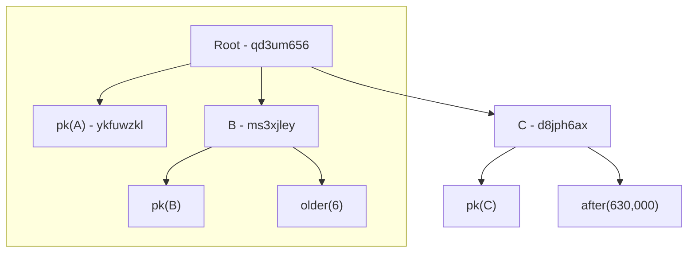

# Interface

Remember the `bdk-cli --help` command you ran before? Let's analyze its output here to figure out the interface:

## Flags

```text
FLAGS:
    -h, --help       Prints help information
    -V, --version    Prints version information
```

These are the optional flags that can be set with every command. The `-h` flag prints the help message, the `-V` flag only prints the version.

### Verbosity

If you want to increase the verbosity of the output, you should use the `RUST_LOG` environment variable. You can set it like so to see a lot more of what's going on behind the scenes, before running the `bdk-cli`
command. You only have to do this once when you open a new shell, after that you can run the `bdk-cli` command multiple times.

```bash
export RUST_LOG="bdk=debug"
```

## Options

```text
OPTIONS:
    -c, --change_descriptor <CHANGE_DESCRIPTOR>        Sets the descriptor to use for internal addresses
    -d, --descriptor <DESCRIPTOR>                      Sets the descriptor to use for the external addresses
        --esplora_concurrency <ESPLORA_CONCURRENCY>    Concurrency of requests made to the esplora server [default: 4]
    -e, --esplora <ESPLORA_URL>                        Use the esplora server if given as parameter
    -n, --network <NETWORK>                            Sets the network [default: testnet]
    -p, --proxy <PROXY_SERVER:PORT>                    Sets the SOCKS5 proxy for the Electrum client
    -s, --server <SERVER:PORT>
            Sets the Electrum server to use [default: ssl://electrum.blockstream.info:60002]

    -w, --wallet <WALLET_NAME>                         Selects the wallet to use [default: main]
```

These are the global options that can be set. They are pretty much like the flags, but they also take a value. The only **required** one is the `--descriptor` or `-d` flag, since every wallet **must have an
associated descriptor**.

The `--change-descriptor` flag can be used to set a different descriptor for the change addresses, sometimes called "internal" addresses in Bitcoin Core. Unfortunately there isn't
[really consensus](https://freenode.irclog.whitequark.org/bitcoin-wizards/2020-01-25#26222504;) on a nice way to encode information about the change derivation inside the standard descriptor, so we are
stuck with having two separate ones. Keep in mind though, that even if you don't specify a change descriptor, you'll still be able to create transactions - the change address will simply be generated from the
standard descriptor.

The `--network` flag can be used to change the network. Right now only `testnet` and `regtest` are supported since the code is very much not production-ready yet.

The `--server` flag can be used to select the Electrum server to use. By default it's connecting to Blockstream's electrum servers, which seems pretty stable.
If you are having connection issues, you can also try with one of the other servers [listed here](https://1209k.com/bitcoin-eye/ele.php?chain=tbtc) and see if you have more luck with those.
Right now both plaintext and ssl servers are supported (prefix `tcp://` or no prefix at all for tcp, prefix `ssl://` for ssl).

The `--esplora` flag can be used to connect to an Esplora instance instead of using Electrum. It should be set to the API's "base url". For public instances of Esplora this is `https://blockstream.info/api` for mainnet
and `https://blockstream.info/testnet/api` for testnet.

The `--proxy` flag can be optionally used to specify a SOCKS5 proxy to use when connecting to the Electrum server. Spawning a local Tor daemon and using it as a proxy will allow you to connect to `.onion` Electrum
URLs. **Keep in mind that only plaintext server are supported over a proxy.**

The `--wallet` flag can be used to select which wallet to use, if you have more than one of them. If you get a `ChecksumMismatch` error when you make some changes to your descriptor, it's because it does not
match anymore the one you've used to initialize the cache. One solution could be to switch to a new wallet name, or delete the cache directory at `~/.bdk-bitcoin` and start from scratch.

## Subcommands

| Command | Description |
| ------- | ----------- |
| [broadcast](#broadcast)         | Broadcasts a transaction to the network. Takes either a raw transaction or a PSBT to extract |
| [bump_fee](#bump_fee)         | Bumps the fees of an RBF transaction |
| [combine_psbt](#combine_psbt)      | Combines multiple PSBTs into one |
| [create_tx](#create_tx)         | Creates a new unsigned tranasaction |
| [extract_psbt](#extract_psbt)      | Extracts a raw transaction from a PSBT |
| [finalize_psbt](#finalize_psbt)     | Finalizes a psbt |
| [get_balance](#get_balance)       | Returns the current wallet balance |
| [get_new_address](#get_new_address)   | Generates a new external address |
| [list_transactions](#list_transactions)      | Lists all the incoming and outgoing transactions of the wallet |
| [list_unspent](#list_unspent)      | Lists the available spendable UTXOs |
| [policies](#policies)          | Returns the available spending policies for the descriptor |
| [public_descriptor](#public_descriptor) | Returns the public version of the wallet's descriptor(s) |
| [repl](#repl)              | Opens an interactive shell |
| [sign](#sign)              | Signs and tries to finalize a PSBT |
| [sync](#sync)              | Syncs with the chosen Electrum server |

These are the main "functions" of the wallet. Most of them are pretty self explanatory, but we'll go over them quickly anyways. You can get more details about every single command by running `bdk-cli <subcommand> --help`.

### broadcast

```text
OPTIONS:
        --psbt <BASE64_PSBT>    Sets the PSBT to extract and broadcast
        --tx <RAWTX>            Sets the raw transaction to broadcast
```

Broadcasts a transaction. The transaction can be a raw hex transaction or a PSBT, in which case it also has to be "finalizable" (i.e. it should contain enough partial signatures to construct a finalized valid scriptsig/witness).

### bump\_fee

```text
FLAGS:
    -a, --send_all    Allows the wallet to reduce the amount of the only output in order to increase fees. This is
                      generally the expected behavior for transactions originally created with `send_all`

OPTIONS:
    -f, --fee_rate <SATS_VBYTE>         The new targeted fee rate in sat/vbyte
    -t, --txid <txid>                   TXID of the transaction to update
        --unspendable <TXID:VOUT>...    Marks an utxo as unspendable, in case more inputs are needed to cover the extra
                                        fees
        --utxos <TXID:VOUT>...          Selects which utxos *must* be added to the tx. Unconfirmed utxos cannot be used
```

Bumps the fee of a transaction made with RBF. The transaction to bump is specified using the `--txid` flag and the new fee rate with `--fee_rate`.

The `--send_all` flag should be enabled if the original transaction was also made with `--send_all`.

### combine\_psbt

```text
OPTIONS:
        --psbt <BASE64_PSBT>...    Add one PSBT to comine. This option can be repeated multiple times, one for each PSBT
```

Combines multiple PSBTs by merging metadata and partial signatures. It can be used to merge multiple signed PSBTs into a single PSBT that contains every signature and is ready to be [finalized](#finalize_psbt).

### create\_tx

```text
FLAGS:
    -r, --enable_rbf        Enables Replace-By-Fee (BIP125)
        --offline_signer    Make a PSBT that can be signed by offline signers and hardware wallets. Forces the addition
                            of `non_witness_utxo` and more details to let the signer identify the change output
    -a, --send_all          Sends all the funds (or all the selected utxos). Requires only one recipients of value 0

OPTIONS:
        --to <ADDRESS:SAT>...                      Adds a recipient to the transaction
        --unspendable <CANT_SPEND_TXID:VOUT>...    Marks a utxo as unspendable
        --external_policy <EXT_POLICY>
            Selects which policy should be used to satisfy the external descriptor

        --internal_policy <INT_POLICY>
            Selects which policy should be used to satisfy the internal descriptor

        --utxos <MUST_SPEND_TXID:VOUT>...          Selects which utxos *must* be spent
    -f, --fee_rate <SATS_VBYTE>                    Fee rate to use in sat/vbyte
```

Creates a new unsigned PSBT. The flags allow to set a custom fee rate (the default is 1.0 sat/vbyte) with `--fee_rate` or `-f`, the list of UTXOs that should be considered unspendable with `--unspendable` (this
option can be specified multiple times) and a list of UTXOs that must be spent with `--utxos` (again, this option can also be specified multiple times).

The `--to` option sets the receiver address of the transaction, and should contain the address and amount in Satoshi separated by a colon, like: `--to 2NErbQPsooXRatRJdrXDm9wKR2fRiZDT9wL:50000`. This option
can also be specified multiple times to send to multiple addresses at once.

The `--send_all` flag can be used to send the value of all the spendable UTXOs to a single address, without creating a change output. If this flag is set, there must be only one `--to` address, and its value will
be ignored (it can be set to 0).

The `--external_policy` and `--internal_policy` options are two advanced flags that can be used to select the spending policy that the sender intends to satisfy in this transaction. They are normally not required if there's no ambiguity, but sometimes
with a complex descriptor one or both of them have to be specified, or you'll get a `SpendingPolicyRequired` error. Those flags should be set to a JSON object that maps a policy node id to the list of child indexes that
the user intends to satisfy for that node. This is probably better explained with an example:

Let's assume our descriptor is: `sh(thresh(2,pk(A),sj:and_v(v:pk(B),n:older(6)),snj:and_v(v:pk(C),after(630000))))`. There are three conditions and we need to satisfy two of them to be able to spend. The conditions are:

1. Sign with the key corresponding to `pk(A)`
2. Sign with the key corresponding to `pk(B)` AND wait 6 blocks
2. Sign with the key corresponding to `pk(C)` AND wait that block 630,000 is reached

So if we write down all the possible outcomes when we combine them, we get:

1. Sign with `pk(A)` + `pk(B)` + wait 6 blocks
2. Sign with `pk(A)` + `pk(C)` + wait block 630,000
3. Sign with `pk(B)` + `pk(C)` + wait 6 blocks + wait block 630,000

In other words:

* If we choose option #1, the final transaction will need to have the `nSequence` of its inputs set to a value greather than or equal to 6, but the `nLockTime` can stay at 0.
* If we choose option #2, the final transaction will need to have its `nLockTime` set to a value greater than or equal to 630,000, but the `nSequence` can be set to a final value.
* If we choose option #3, both the `nSequence` and `nLockTime` must be set.

The wallet can't choose by itself which one of these combination to use, so the user has to provide this information with the `--external_policy` flag.

Now, let's draw the condition tree to understand better how the chosen policy is represented: every node has its id shown right next to its name, like `qd3um656` for the root node. These ids can be seen by running the [policies](#policies) command.
Some ids have been omitted since they are not particularly relevant, in this example we will actually only use the root id.



Let's imagine that we are walking down from the root, and we want to use option #1. So we will have to select `pk(A)` + the whole `B` node. Since these nodes have an id, we can use it to refer to them and say which children
we want to use. In this case we want to use children #0 and #1 of the root, so our final policy will be: `--external_policy {"qd3um656":[0,1]}`.

### extract\_psbt

```text
OPTIONS:
        --psbt <BASE64_PSBT>    Sets the PSBT to extract
```

Extracts the global transaction from a PSBT. **Note that partial signatures are ignored in this step. If you want to merge the partial signatures back into the global transaction first, please use [finalize_psbt](#finalize_psbt) first**

### finalize\_psbt

```text
OPTIONS:
        --psbt <BASE64_PSBT>        Sets the PSBT to finalize
        --assume_height <HEIGHT>    Assume the blockchain has reached a specific height
```

Tries to finalize a PSBT by merging all the partial signatures and other elements back into the global transaction. This command fails if there are timelocks that have not yet expired, but the check can be overridden
by specifying `--assume_height` to make the wallet assume that a future height has already been reached.

### get\_balance

This subcommand has no extra flags, and simply returns the available balance in Satoshis. This command **should normally be called after [`sync`](#sync)**, since it only looks into the local cache to determine the list of UTXOs.

### get\_new\_address

This subcommand has no extra flags and returns a new address. It internally increments the derivation index and saves it in the database.

### list\_transactions

This subcommand has no extra flags and returns the history of transactions made or received by the wallet, with their txid, confirmation height and the amounts (in Satoshi) "sent" (meaning, the sum of the wallet's inputs spent in the transaction) and
"received" (meaning, the sum of the outputs received by the wallet). Just like [`get_balance`](#get_balance) it **should normally be called after [`sync`](#sync)**, since it only operates
on the internal cache.

### list\_unspent

This subcommand has no extra flags and returns the list of available UTXOs and their value in Satoshi. Just like [`get_balance`](#get_balance) it **should normally be called after [`sync`](#sync)**, since it only operates
on the internal cache.

### policies

This subcommand has no extra flags and returns the spending policies encoded by the descriptor in a more human-readable format. As an example, running the `policies` command on the descriptor shown earlier for the
in the explanation of the [create_tx](#create_tx) command, it will return this:

```json
{
  "id":"qd3um656",
  "type":"THRESH",
  "items":[
    {
      "id":"ykfuwzkl",
      "type":"SIGNATURE",
      "pubkey":"...",
      "satisfaction":{
        "type":"NONE"
      },
      "contribution":{
        "type":"COMPLETE",
        "condition":{

        }
      }
    },
    {
      "id":"ms3xjley",
      "type":"THRESH",
      "items":[
        {
          "id":"xgfnp9rt",
          "type":"SIGNATURE",
          "pubkey":"...",
          "satisfaction":{
            "type":"NONE"
          },
          "contribution":{
            "type":"COMPLETE",
            "condition":{

            }
          }
        },
        {
          "id":"5j96ludf",
          "type":"RELATIVETIMELOCK",
          "value":6,
          "satisfaction":{
            "type":"NONE"
          },
          "contribution":{
            "type":"COMPLETE",
            "condition":{
              "csv":6
            }
          }
        }
      ],
      "threshold":2,
      "satisfaction":{
        "type":"NONE"
      },
      "contribution":{
        "type":"PARTIALCOMPLETE",
        "n":2,
        "m":2,
        "items":[
          0,
          1
        ],
        "conditions":{
          "[0, 1]":[
            {
              "csv":6
            }
          ]
        }
      }
    },
    {
      "id":"d8jph6ax",
      "type":"THRESH",
      "items":[
        {
          "id":"gdl039m6",
          "type":"SIGNATURE",
          "pubkey":"...",
          "satisfaction":{
            "type":"NONE"
          },
          "contribution":{
            "type":"COMPLETE",
            "condition":{

            }
          }
        },
        {
          "id":"xpf2twg8",
          "type":"ABSOLUTETIMELOCK",
          "value":630000,
          "satisfaction":{
            "type":"NONE"
          },
          "contribution":{
            "type":"COMPLETE",
            "condition":{
              "timelock":630000
            }
          }
        }
      ],
      "threshold":2,
      "satisfaction":{
        "type":"NONE"
      },
      "contribution":{
        "type":"PARTIALCOMPLETE",
        "n":2,
        "m":2,
        "items":[
          0,
          1
        ],
        "conditions":{
          "[0, 1]":[
            {
              "timelock":630000
            }
          ]
        }
      }
    }
  ],
  "threshold":2,
  "satisfaction":{
    "type":"NONE"
  },
  "contribution":{
    "type":"PARTIALCOMPLETE",
    "n":3,
    "m":2,
    "items":[
      0,
      1,
      2
    ],
    "conditions":{
      "[0, 1]":[
        {
          "csv":6
        }
      ],
      "[0, 2]":[
        {
          "timelock":630000
        }
      ],
      "[1, 2]":[
        {
          "csv":6,
          "timelock":630000
        }
      ]
    }
  }
}
```

This is a tree-like recursive structure, so it tends to get huge as more and more pieces are added, but it's in fact fairly simple. Let's analyze a simple node of the tree:

```json
{
  "id":"qd3um656",
  "type":"SIGNATURE",
  "pubkey":"...",
  "satisfaction":{
    "type":"NONE"
  },
  "contribution":{
    "type":"COMPLETE",
    "condition":{}
  }
}
```

* `id` is a unique identifier to this specific node in the tree.
* `type`, as the name implies, represents the type of node. It defines what should be provided to satisfy that particular node. Generally some other data are provided to give meaning to
  the type itself (like the `pubkey` field here in the example). There are basically two families of types: some of them can only be used as leaves, while some other can only be used as intermediate nodes.

  Possible leaf nodes are:
    - `SIGNATURE`, requires a signature made with the specified key. Has a `pubkey` if it's a single key, a `fingerprint` if the key is an xpub, or a `pubkey_hash` if the full public key is not present in the descriptor.
    - `SIGNATUREKEY`, requires a signature plus the raw public key. Again, it can have a `pubkey`, `fingerprint` or `pubkey_hash`.
    - `SHA256PREIMAGE`, requires the preimage of a given `hash`.
    - `HASH256PREIMAGE`, requires the preimage of a given `hash`.
    - `RIPEMD160PREIMAGE`, requires the preimage of a given `hash`.
    - `HASH160PREIMAGE`, requires the preimage of a given `hash`.
    - `ABSOLUTETIMELOCK`, doesn't technically require anything to be satisfied, just waiting for the timelock to expire. Has a `value` field with the raw value of the timelock (can be both in blocks or time-based).
    - `RELATIVETIMELOCK`, again only requires waiting for the timelock to expire. Has a `value` like `ABSOLUTETIMELOCK`.

  Possible non-leaf nodes are:
    - `THRESH`, defines a threshold of policies that has to be met to satisfy the node. Has an `items` field, which is a list of policies to satisfy and a `threshold` field that defines the threshold.
    - `MULTISIG`, Similar to `THRESH`, has a `keys` field, which is a list of keys represented again as either `pubkey`, `fingerprint` or `pubkey_hash` and a `threshold` field.

* `satisfaction` is currently not implemented and will be used to provide PSBT introspection, like understanding whether or not a node is already satisfied and to which extent in a PSBT.
* `contribution` represents if so and how much, the provided descriptor can contribute to the node.

  The possible types are:
    - `NONE`, which means that the descriptor cannot contribute.
    - `COMPLETE`, which means that the descriptor by itself is enough to completely satisfy the node. It also adds a `condition` field which represent any potential extra condition that has to be met to
      consider the node complete. An example are the timelock nodes, that are always complete *but* they have an extra `csv` or `timelock` condition.
    - `PARTIAL`, which means that the descriptor can partially satisfy the descriptor. This adds a `m`, `n`, `items` that respectively represent the threshold, the number of available items to satisfy and the items
      that the provided descriptor can satisfy. Also adds a `conditions` field which is an integer to list of conditions map. The key is the child index and the map are all the possibile extra conditions that
      have to be satisfied if that node is used in the threshold. For instance, if you have a threshold of a SIGNATURE and a RELATIVETIMELOCK, in this order, the `conditions` field will be `1 ⇒ csv(x)`,
      because the item at index 1 needs the extra csv condition.
    - `PARTIALCOMPLETE`, which is basically a `PARTIAL` with the size of `items` >= `m`. It's treated as a separate entity to make the code a bit more clean and easier to implement. Like `PARTIAL`, it also has
      a `m`, `n`, `items` fields but the `conditions field` is a bit different: it's a list of integers to list of conditions map. The key represents the combination that can be used to satisfy the threshold,
      and the value contains all the possible conditions that also have to be satisfied. For instance, if you have a 2-of-2 threshold of a TIMELOCK and a RELATIVETIMELOCK, the `conditions` field will be `[0, 1] ⇒
      csv(x) + timelock(y)`, because if the combination of items 0 and 1 is picked, both of their conditions will have to be meet too.

While the structure contains all of the intermediate nodes too, the root node is the most important one because defines how the descriptor can contribute to spend outputs sent to its addresses.

For instance, looking at the root node of the previous example (with the internal `items` omitted) from a descriptor that has all the three private keys for keys A, B and C, we can clearly see that it can satisfy
the descriptor (type = `PARTIALCOMPLETE`) and the three options are `[0, 1] ⇒ csv(6)` (Option #1), `[0, 2] ⇒ timelock(630,000)` (Option #2) or `[1, 2] ⇒ csv(6) + timelock(630,000)` (Option #3).

```json
{
  "type":"THRESH",
  "items":[],
  "threshold":2,
  "satisfaction":{
    "type":"NONE"
  },
  "contribution":{
    "type":"PARTIALCOMPLETE",
    "n":3,
    "m":2,
    "items":[
      0,
      1,
      2
    ],
    "conditions":{
      "[0, 1]":[
        {
          "csv":6
        }
      ],
      "[0, 2]":[
        {
          "timelock":630000
        }
      ],
      "[1, 2]":[
        {
          "csv":6,
          "timelock":630000
        }
      ]
    }
  }
}
```

### `public_descriptor`

This subcommand has no extra flags and returns the "public" version of the wallet's descriptor(s). It can be used to bootstrap a watch-only instance for the wallet.

### `repl`

This subcommand has no extra flags and launches an interactive shell session.

### `sign`

```text
OPTIONS:
          --psbt <BASE64_PSBT>        Sets the PSBT to sign
          --assume_height <HEIGHT>    Assume the blockchain has reached a specific height. This affects the transaction
                                      finalization, if there are timelocks in the descriptor
```

Adds to the PSBT all the signatures it can produce with the secrets embedded in the descriptor (xprv or WIF keys). Returns the signed PSBT and, if there are enough item to satisfy the script, also the extracted raw
Bitcoin transaction.

Optionally, the `assume_height` option can be specified to let the wallet assume the blockchain has reached a specific height. This affects the finalization of the PSBT which is done right at the end of the signing
process: the wallet tries to satisfy the spending condition of each input using the partial signatures collected. In case timelocks are present the wallet needs to know whether or not they have expired. This flag
is particularly useful for offline wallets.

### `sync`

This subcommand has no extra flags. It connects to the chosen Electrum server and synchronizes the list of transactions received and available UTXOs.
