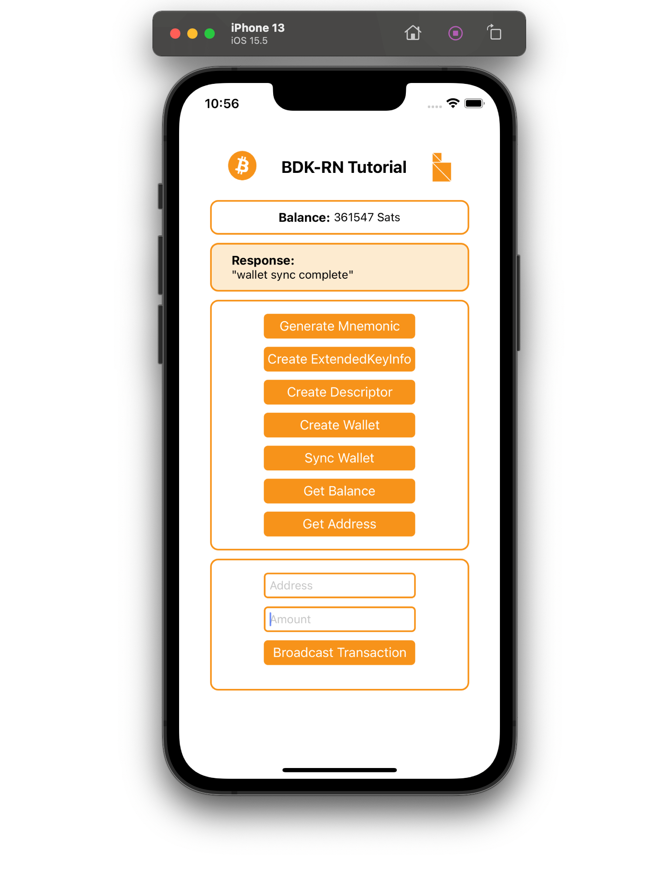
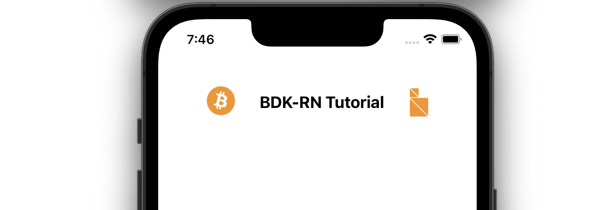

## Introduction

// TODO: Improve context at start

The wallet we create will be a non custodial HD Wallet, the app will be able to create a new wallet or restore from a known mnemonic seed phrase. Creating new addresses, syncing all UTXOs from a bitcoin node to get balance and send bitcoin. Figure 1. is our end goal.
The tutorial will focus on bitcoin and bdk-rn concepts and api and will gloss over react native related aspects. 
All the code for this tutorial is available on Github at https://github.com/LtbLightning/AwesomeBitcoinApp

Figure 1. is our end goal, an app that interacts with the bitcoin network manages keys and utxos, and synchs utxos from new blocks and broadcasts tansactioins.


// TODO: replace with image based on the respository , ensure buttons are in the same order and section styles are the same as the repository



### Prerequisites

In order ot use bdk-rn in a React Native app a React Native development environment is required. Please refer to resources out there on the internet if you need to set this, here is one of many good resources to guide you https://reactnative.dev/docs/environment-setup

### Bitcoin Basics

The bitcoin concepts used in this blog post are detailed and explained very well in external bitcoin resources here are some links for reference:

Mastering Bitcoin(HD Wallet chapter): https://www.oreilly.com/library/view/mastering-bitcoin/9781491902639/ch04.html
Bitcoin Output Descriptors from bitocoin GitHub: https://github.com/bitcoin/bitcoin/blob/master/doc/descriptors.md

Now lets jumpt into Bitcoin Dev Kit 🪂

## Bitcoin Dev Kit and bdk-rn

`bdk-rn` is a React Native library of Bitcoin Dev Kit(BDK) for building React Native Apps.
It encapsulates all of the low level api and methods for BDK and exposes them in a react native context. To use BDK in React Native(RN) apps only `bdk-rn` module is required. `Bdk-rn` can be used like any other react native library and is available in public package managers.

## Getting Started

Although we wont delve deep into RN we will focus more on bitcoin and bdk-rn, however some rudimentary RN setup is required, especially a basic RN app to add our bitocoin code.

Lets start by creating a new RN project.

`npx react-native init AwesomeBitcoinApp`

If this fails end is error on an M1 Mac please use
 `arch -x86_64 pod install --repo-update`

Once done lets `cd` into the new project and run the basic RN app thats created

```shell
cd AwesomeBitcoinApp
yarn ios
```

This should start building the app and then launch the app in an ios simulator. So far we have created a basic RN project if this doesn't work then refer to the  react native development setup guide to troubleshoot.


## Setting up styles and RN app structure

Lets setup a very basic app structure and some RN scaffolding. Lets create a `src` folder in the project root and then add new folders for `assets`, `elements`, `screens` and `styles`

To make this quick you can download the styles and images used in the tutorial from the repository. The image assets, `Button.tsx` and `styles.js` can be take from https://github.com/LtbLightning/AwesomeBitcoinApp/tree/master/src and moved the folders as shown. Alternatively you can write your own styles and use your own images if you intend to style the app in a different way.

Lets create a `home.js` file under screens, this will be where we will be adding most of our code.

Once done the file structure should look like Figure 3.


Locate `App.js` in the project root, this will have the default code adde by react-native init, lets delete all contents of `App.js` and replace with code to import `home.js` as our main screen.

```javascript
// App.js 

import React from 'react';
import Home from './src/screens/home';

const App = () => {
  return <Home />;
};

export default App;

```

This will probably crash your app in the simulator but thats fine, it will be fixed in the next step.

## Installing `bdk-rn`

With the RN app project in place, we can now add `bdk-rn` using either npm or yarn.

Using npm:

```shell
npm i --save bdk-rn
```

Using yarn:

```shell
yarn add bdk-rn
```

[IOS Only] Install pods:

```shell
npx pod-install
or
cd ios && pod install && cd ..
```

Verify that `bdk-rn` has been added to `package.json`, once done `bdk-rn` is installed and ready to be used in our **AwesomeBitcoinApp**

## Importing `bdk-rn`

Locate home.js which we added in the setup section and import bdk-rn and also create a RN functional component.

```javascript
// screens/home.js

import BdkRn from 'bdk-rn';

const Home = () => {
}

export default Home;

```


Before we start using `bdk-rn` lets add some additional RN component imports, as well as importing styles, button and image assets to create a basic layout to build our home screen

```jsx
// screens/home.js

import BdkRn from 'bdk-rn';
import React, { Fragment, useState } from 'react';
import {
  ActivityIndicator,
  SafeAreaView,
  ScrollView,
  StatusBar,
  Text,
  TextInput,
  View,
  Image,
} from 'react-native';
import Button from '../elements/Button';
import { styles } from '../styles/styles';
const bitcoinLogo = require('../assets/bitcoin_logo.png');
const bdkLogo = require('../assets/bdk_logo.png');

const Home = () => {
  // BDK-RN method calls and state variables will be added here

  return (
    <SafeAreaView>
      <StatusBar />
      <ScrollView
        contentInsetAdjustmentBehavior="automatic"
        contentContainerStyle={styles.container}>
        {/* Header */}
        <View style={styles.headerSection}>
          <Image
            style={{ resizeMode: 'stretch', height: 36, width: 36 }}
            source={bitcoinLogo}
          />
          <Text style={styles.headerText}>BDK-RN Tutorial</Text>
          <Image
            style={{ resizeMode: 'center', height: 40, width: 25 }}
            source={bdkLogo}
          />
        </View>

        {/* Balance */}

        {/* method call result */}

        {/* buttons for method calls */}

        {/* input boxes and send transaction button */}

      </ScrollView>
    </SafeAreaView>
  );
};

export default Home;

```


We now have a app title section and a structure to hold the rest of our app components.



## Calling bdk-rn methods

All `bdk-rn` methods return a json response with a data and error**All methods return response as follows:**

```javascript
Promise<Response> = {
  error: true | false; // success returns true else false.
  data: string | object | any; // output data for the method call.
}
```

The first step in creating a non custodial bitcoin app is creating a mnemonic seed phrase for the wallet.

`bdk-rn` provides `generateMnemonic()` method to create a default 12 word length mnemonic. 

```javascript
import BdkRn from 'bdk-rn';

const response = await BdkRn.generateMnemonic();
const mnemonic  = response.data;
```

We can specify a longer length or we can also specify the bits of entropy we need by passing the length or entropy arguments.

To create a mnemonic with an entropy of 256 bits which will be a 24 word length mnemonic sentence we can use.
Refer to readme on Github: https://github.com/LtbLightning/bdk-rn#generatemnemomic

```javascript
const {data: mnemonic} = await BdkRn.generateMnemonic({ entropy: 256 });
// here data is destructured and saved as 'mnemonic'
```

In order ot use this in our RN app lets create a state variable to store the mnemonic and internal `generateMnemonic`  method which we can invoke when a button is clicked. We will also need a button which will invoke generateMnemonic when clicked. Adding the following code achieves all of this.

```jsx
// screens/home.js

const Home = () => {
  // BDK-RN method calls and state variables will be added here
  // state variable to store and set mnemonic
  const [mnemonic, setMnemonic] = useState('');

  // internal method to call bdk-rn to generate mnemonic
 const getMnemonic = async () => {
		// call bdk-rn to generate mnemonic
    const {data} = await BdkRn.generateMnemonic({
      length: 12
    });
   // save generated mnemonic to state variable
    setMnemonic(data);
  };

return (
    <SafeAreaView>
      <StatusBar />
      <ScrollView
        contentInsetAdjustmentBehavior="automatic"
        contentContainerStyle={styles.container}>
        {/* Header */}
        <View style={styles.headerSection}>
          <Image
            style={{ resizeMode: 'stretch', height: 36, width: 36 }}
            source={bitcoinLogo}
          />
          <Text style={styles.headerText}>BDK-RN Tutorial</Text>
          <Image
            style={{ resizeMode: 'center', height: 40, width: 25 }}
            source={bdkLogo}
          />
        </View>

        {/* Balance */}

        {/* method call result */}

        {/* buttons for method calls */}
        <View style={styles.methodSection}>
          <Button
            title="Generate Mnemonic"
            style={styles.methodButton}
            onPress={getMnemonic}
          />
        </View>

        {/* input boxes and send transaction button */}
      </ScrollView>
    </SafeAreaView>
  );
};


```

Now we need to add a component to display output of our method calls and this will also need a state variable to track our method call response. To achive this add the following code.

```javascript
// screens/home.js

// add this as another state variable under mnemonic
const [displayText, setDisplayText] = useState('');

// modify the generateMnenomic method to also set mnemonic as displayText

  const getMnemonic = async () => {
    const {data} = await BdkRn.generateMnemonic({
      length: 12,
      network: 'testnet',
    });
    setMnemonic(JSON.stringify(data));
    setDisplayText(JSON.stringify(data));
  };

```

and finally lets add the component to display the output under `{/* method call result */}`

```jsx

 {/* method call result */}
	// display the component only if displayText has a value
	{displayText && (
          <View style={styles.responseSection}>
            <Text style={styles.responseText} selectable>
              Response:
            </Text>
            <Text selectable>{displayText}</Text>
          </View>
        )}
```

We should now have a working" Generate Mnemonic" button which displays the new mnemonic


A quick recap, we added a button to trigger call to a method. We created a click handler to call bdk-rn. Set the display state variable to display the output of the call in the display section. We will follow this pattern for the remaining calls to bdk-rn.

## Wallet and balance

Before moving on the wallet and balances lets add a section at the to display the balance of the wallet.

To display the balance we will need to state variable to store the balance and a display section to display.

Under the `mnemonic` and `displayText` variables, lets add one for `balance` as well

```jsx
	const Home = () => {
		// BDK-RN method calls and state variables will be added here
  	const [mnemonic, setMnemonic] = useState('');
  	const [displayText, setDisplayText] = useState('');
  	const [balance, setBalance] = useState();

```

And we will shortly need a `wallet`, a `syncResponse` and `address` as well so lets add all these:

```jsx
	const Home = () => {
		// BDK-RN method calls and state variables will be added here
  	const [mnemonic, setMnemonic] = useState('');
  	const [displayText, setDisplayText] = useState('');
  	const [balance, setBalance] = useState();
    const [wallet, setWallet] = useState();
  	const [syncResponse, setSyncResponse] = useState();
  	const [address, setAddress] = useState();
  

```

Now we need some `jsx` code to display the balance.

Just below `{/* Balance */}`  and above `{*/ method call result */}` add the following ui components

```jsx
				{/* Balance */}
				<View style={styles.balanceSection}>
          <Text style={styles.balanceText} selectable>
            {'Balance: '}
          </Text>
          <Text selectable>{balance ? balance : '0'} Sats</Text>
        </View>
				{/* method call result */}
```

We will next add code to create a wallet, sync utxos with bitcoin node and get balance.

To create a wallet the simple approach is to call `createWallet()` method with `mnemonic` , `password` and `network`.
Lets add another click hander below where we have the `getMnemonic()` method
We want to see the response of this call so lets use `setDisplayText()` to see the output

```javascript

  const createWallet = async () => {
     const { data } = await BdkRn.createWallet({
      mnemonic: mnemonic,
      password: 'password',
      network: 'testnet',
    });
    setWallet(data);
    setDisplayText(JSON.stringify(data));
  };

```

A new button will be required to trigger `createWallet` 

Lets add a new button just above `{/* input boxes and send transaction button */}` 

```jsx
				<Button
            title="Create Wallet"
            style={styles.methodButton}
            onPress={createWallet}
          />
        </View>
        {/* input boxes and send transaction button */}

```

The response returned by `createWallet` is a new address for the created wallet.

```javascript
{
  "data": {
    "address": "tb1qxg8g8cdzgs09cttu3y7lc33udqc4wsesunjnhe"
  },
  "error": false
}
```

Our app should now be creating a wallet when we click **Create Mnemonic** followed by **Create Wallet** 


The wallet created is a HD wallet and the address displayed is the 0 index address for the wallet.  The path used by default is 84'/1'/0'/0/* for addresses and 84'/1'/0'/1/* for change.

Using just mnemonic is a quick route to creating a wallet with bdk-rn. The `createWallet()` method in `bdk-rn` has many optional arguments to configure the wallet. In addition to mnemonic a wallet can be creatd with a descriptor as well. If a descriptor is passed as an argument the wallet will be created using the descriptor. When using a descriptor, arguments for network, password and menmonic are not required. bdk-rn has a `createDescriptor()` method to create a descriptor. More about output descriptors here https://github.com/bitcoin/bitcoin/blob/master/doc/descriptors.md and here https://github.com/LtbLightning/bdk-rn#createdescriptor

```javascript
// using a descriptor to create wallet 
const response = await BdkRn.createWallet({
  descriptor:
  'tprv8ZgxMBicQKsPd3G66kPkZEuJZgUK9QXJRYCwnCtYLJjEZmw8xFjCxGoyx533AL83XFcSQeuVmVeJbZai5RTBxDp71Abd2FPSyQumRL79BKw'
});
```

Other arguments for create wallet are:

**blockChainName**: Blockchain backend to use, like [`electrum` (opens new window)](https://github.com/romanz/electrs), [`esplora` (opens new window)](https://github.com/Blockstream/esplora), `compact-filters` ([BIP157 (opens new window)](https://github.com/bitcoin/bips/blob/master/bip-0157.mediawiki)) and Bitcoin Core. bdk-rn at the moment doesn't support compact-filters and Bitcoin Core, this will be added shortly in a future release.

**blockChainConfigUrl**: This is the url of the specified bitcoin node this should match the chain and the type of blockchain specified as **blockChainName**

Refer to readme for a complete list of optioins for `createWallet`: https://github.com/LtbLightning/bdk-rn#createwallet


[bdk-rn]: https://github.com/LtbLightning/bdk-rn
[bdk]: https://github.com/bitcoindevkit
[Awesome Bitcoin App Github Repository]:https://github.com/LtbLightning/AwesomeBitcoinApp
[Setup React Native Development Environment]: https://reactnative.dev/docs/environment-setup
[Mastering Bitcoin(HD Wallet chapter)]: https://www.oreilly.com/library/view/mastering-bitcoin/9781491902639/ch04.html
[Bitcoin Output Descriptors from bitcoin GitHub]: https://github.com/bitcoin/bitcoin/blob/master/doc/descriptors.md


[^WIF]: Wallet Input Format, a string encoding a ECDSA private key  https://en.bitcoin.it/wiki/Wallet_import_format
[^WIFcore]: Unless the user import the WIF directly into bitcoin core
[^sweep]: Some wallets refers to sweep as the action to create a transaction taking all the funds from the paper wallet and sending those to the wallet itself.
[^blackzone]: Ideally, the black zone should be twice as long as the secret part to cover it back and front, long descriptor may leave a shorter black zone, ensure to have you printer set with vertical layout for best results.
