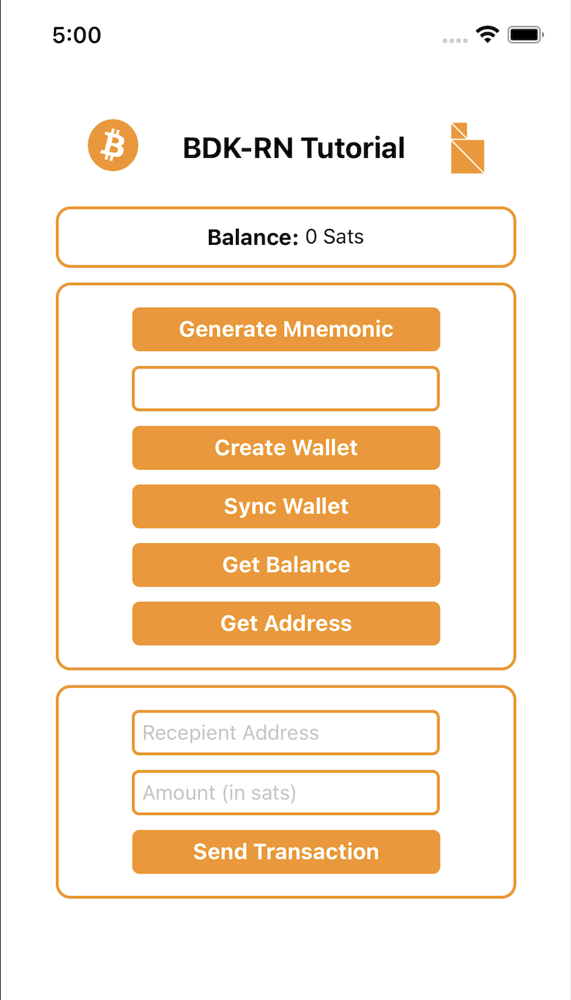
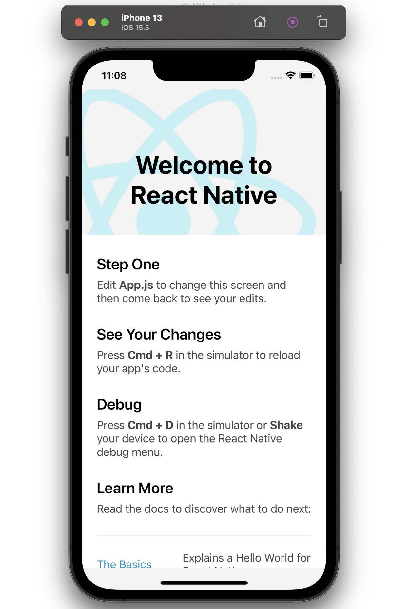
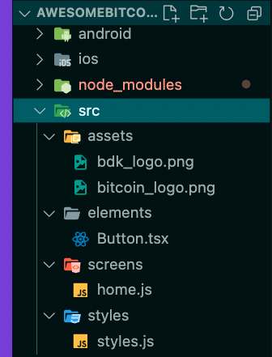
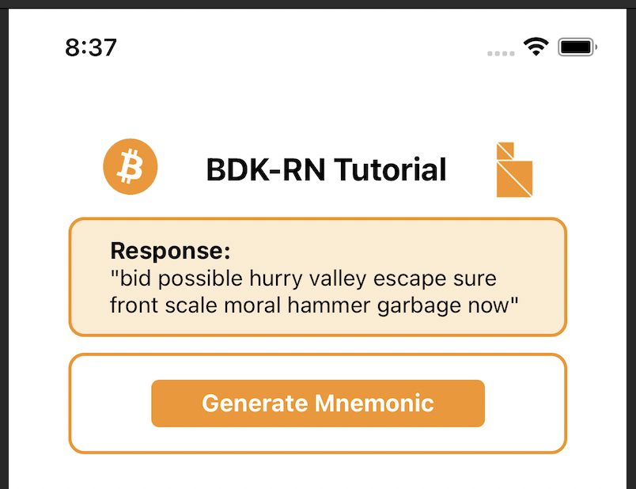
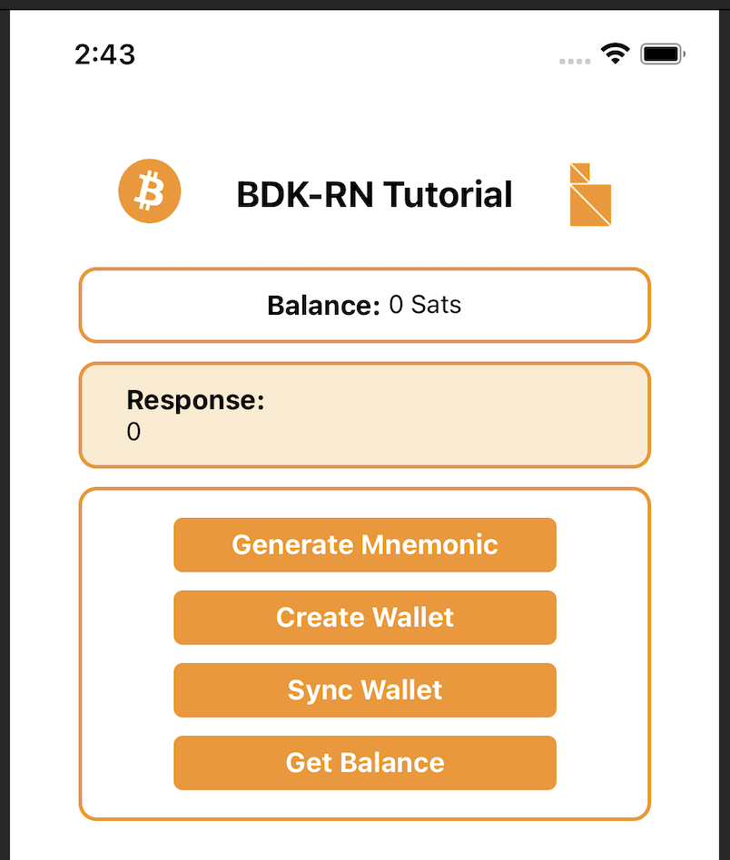
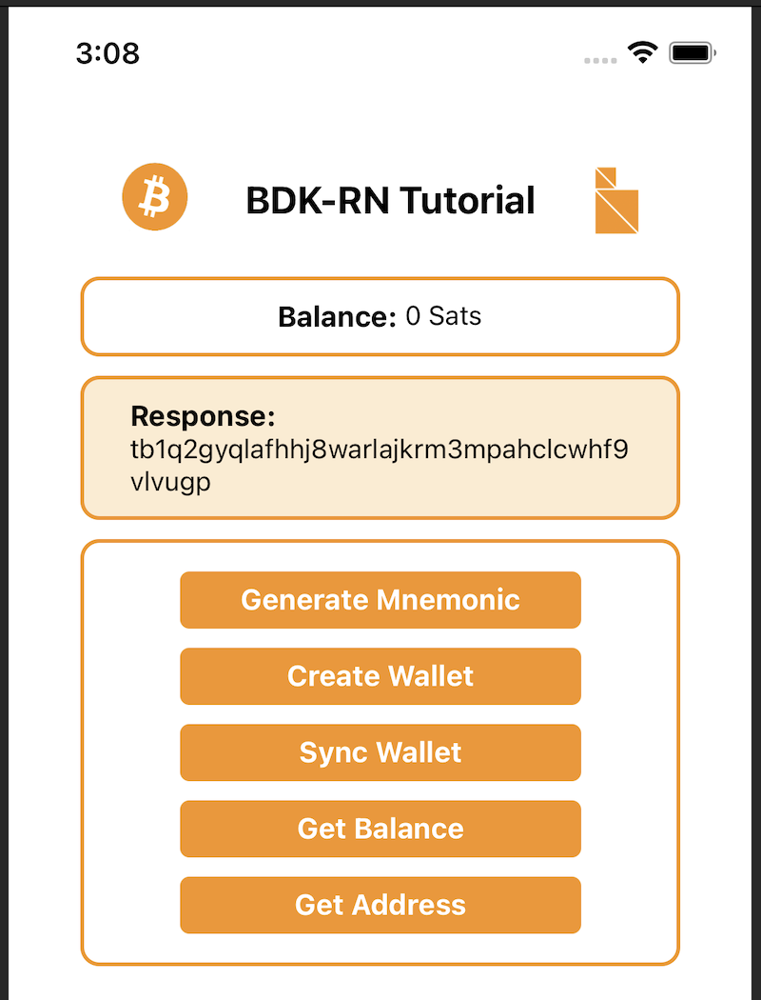
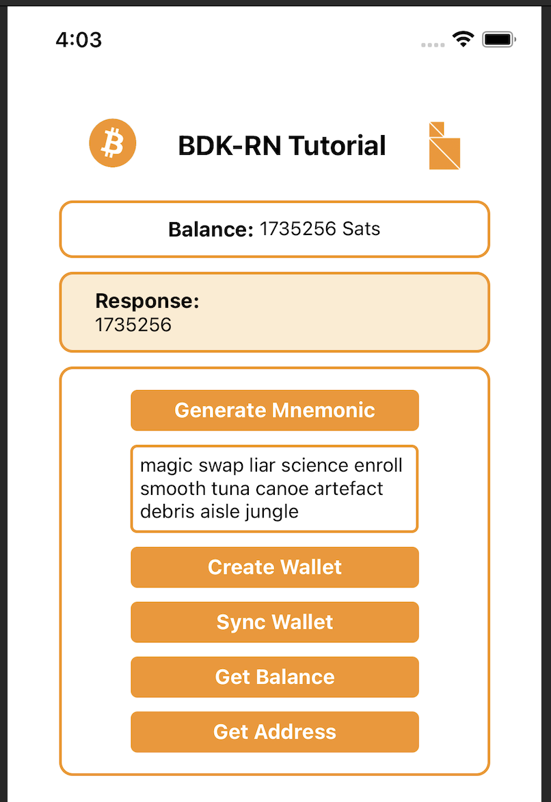
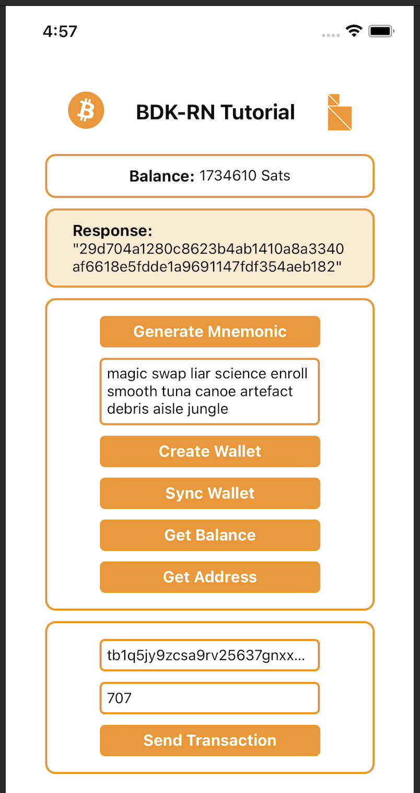

## Introduction

`bdk-rn` is the **Bitcoin Dev kit**'s **React Native** library which enables building bitcoin applications for Android and iOS mobile platforms. Using bdk-rn does not require knowledge of the underlying bitcoin or BDK API. Using `bdk-rn` is similar to using any other RN module. Just do `yarn add bdk-rn` and you are ready to code!  This is the first tutorial on how to use bdk-rn, more coming soon, make sure to [follow](https://twitter.com/BitcoinZavior?ref_src=twsrc%5Etfw) to be notified of new ones. In case you missed it, there is a recorded bdk-rn focused Twitch Livestream available on the [Bitcoin Developers](https://www.youtube.com/watch?v=gMpWA875go4) YouTube channel which covers most of this article, make sure to [subscribe](https://www.youtube.com/channel/UCUq_ZdezVWKPvkWRicAYxLA/videos) for more.

In this tutorial, we will explore `bdk-rn` ousage and the API it provides. This guide will walk through the development process and code for making a bitcoin application. The bitcoin application we create will be a non-custodial HD Wallet. The application will have the functionality to create a new wallet or restore from a known mnemonic seed phrase. This application will also be able to interact with the bitcoin network to sync UTXOs from new blocks and broadcast transactions.

The tutorial will focus on bitcoin and `bdk-rn` concepts and API. So it will gloss over React Native aspects. The code for this tutorial is available on the [LtbLightning GitHub](https://github.com/LtbLightning/BdkRnQuickStart)




### Prerequisites

In order to use bdk-rn in a React Native App, a React Native development environment is required. Please refer to resources out there on the internet if you need to set this up, here is one of many good resources to guide you https://reactnative.dev/docs/environment-setup

### Bitcoin Basics

The bitcoin concepts used in this blog post are detailed and explained very well in external bitcoin resources. Here are some links for reference:

[Mastering Bitcoin(HD Wallet chapter)](https://github.com/bitcoinbook/bitcoinbook/blob/develop/ch04.asciidoc)

[Bitcoin Output Descriptors from bitcoin GitHub](https://github.com/bitcoin/bitcoin/blob/master/doc/descriptors.md)

Now let's jump into Bitcoin Dev Kit

## Bitcoin Dev Kit and bdk-rn

`bdk-rn` is a React Native library of Bitcoin Dev Kit(BDK) for building React Native Apps.
It encapsulates all of the low-level APIs and methods for BDK and exposes them in a react native context. To use BDK in React Native(RN) apps only the `bdk-rn` module is required. `Bdk-rn` can be used like any other react native library and is available in public package managers.

## Getting Started

Although we won't delve deep into RN we will focus more on bitcoin and bdk-rn, however, some rudimentary RN setup is required, especially a basic RN app to add our code.

 start by creating a new RN project.

`npx react-native init BdkRnQuickStart`

If this fails in an error on an M1/M2 Mac please use
 `arch -x86_64 pod install --repo-update`

Once done `cd` into the new project directory and run the basic RN app that's created

```shell
cd BdkRnQuickStart
yarn ios
```

This should start building the app and launch the app in a simulator. So far we have created a basic RN project if this doesn't work then refer to the React Native development setup guide to troubleshoot.




## Setting up styles and RN app structure

Let's set up a very basic app structure and some RN scaffolding. Let's create an `src` folder in the project root and inside it add new folders for `assets`, `elements`, `screens` and `styles`

To make this quick you can download the styles and images used in the tutorial from the repository. The image assets, `Button.tsx` and `styles.js` can be taken from [here](https://github.com/LtbLightning/BdkRnQuickStart/tree/master/src) and moved to the folders as shown. Alternatively, you can write your own styles and use your own images if you intend to style the app in a different way.

 Create a `home.js` file under `screens` folder, this will be where we will be adding most of the code.

Once done the project structure should look like this:




Locate `App.js` in the project root, this will have the default code added by `react-native init`, let's delete all contents of `App.js` and replace it with code to import `home.js` as our main screen.

```javascript
// App.js 

import React from 'react';
import Home from './src/screens/home';

const App = () => {
  return <Home />;
};

export default App;
```

This will probably crash your app in the simulator but that's fine, it will be fixed in the next step.

## Installing `bdk-rn`

With the RN app project in place, we can now add `bdk-rn` using either npm or yarn.

Using npm:

```shell
npm i --save bdk-rn
```

Using yarn:

```shell
yarn add bdk-rn
```

[iOS Only] Install pods:

```shell
npx pod-install
or
cd ios && pod install && cd ..
```

Verify that `bdk-rn` has been added to `package.json`, once done `bdk-rn` is installed and ready to be used in our **BdkRnQuickStart** App.

## Importing `bdk-rn`

Locate `home.js` which we added in the setup section and import `bdk-rn` and also create an RN functional component.

```javascript
// screens/home.js

import BdkRn from 'bdk-rn';

const Home = () => {
}

export default Home;
```


Before we start using `bdk-rn` let's add some additional RN component imports, as well as import styles, a button and image assets to create a basic layout to build our home screen.

```jsx
// screens/home.js

import BdkRn from 'bdk-rn';
import React, { Fragment, useState } from 'react';
import {
  ActivityIndicator,
  SafeAreaView,
  ScrollView,
  StatusBar,
  Text,
  TextInput,
  View,
  Image,
} from 'react-native';
import Button from '../elements/Button';
import { styles } from '../styles/styles';
const bitcoinLogo = require('../assets/bitcoin_logo.png');
const bdkLogo = require('../assets/bdk_logo.png');

const Home = () => {
  // BDK-RN method calls and state variables will be added here

  return (
    <SafeAreaView>
      <StatusBar />
      <ScrollView
        contentInsetAdjustmentBehavior="automatic"
        contentContainerStyle={styles.container}>
        {/* Header */}
        <View style={styles.headerSection}>
          <Image
            style={{ resizeMode: 'stretch', height: 36, width: 36 }}
            source={bitcoinLogo}
          />
          <Text style={styles.headerText}>BDK-RN Tutorial</Text>
          <Image
            style={{ resizeMode: 'center', height: 40, width: 25 }}
            source={bdkLogo}
          />
        </View>

        {/* Balance */}

        {/* method call result */}

        {/* buttons for method calls */}

        {/* input boxes and send transaction button */}

      </ScrollView>
    </SafeAreaView>
  );
};

export default Home;
```

We now have an app title section and a structure to hold the rest of our app components.


## Calling bdk-rn methods

All `bdk-rn` methods return a JSON response with data and error properties. All methods return a  response as follows:

```javascript
Promise<Response> = {
  error: true | false; // success returns true else false.
  data: string | object | any; // output data for the method call.
}
```

The first step in creating a non-custodial bitcoin app is creating a mnemonic seed phrase for the wallet.

`bdk-rn` provides `generateMnemonic()` method to create a default 12 word length mnemonic. 

```javascript
import BdkRn from 'bdk-rn';

const response = await BdkRn.generateMnemonic();
const mnemonic  = response.data;
```

We can specify a longer length or we can also specify the bits of entropy we need by passing the length or entropy arguments.

To create a mnemonic with an entropy of 256 bits which will be a 24-word length mnemonic sentence we can use `{ entropy: 256 }`.
Refer to the readme file on [GitHub](https://github.com/LtbLightning/bdk-rn#generatemnemomic)

```javascript
const {data: mnemonic} = await BdkRn.generateMnemonic({ entropy: 256 });
// here data is destructured and saved as 'mnemonic'
```

In order to use this in our RN app let's create a state variable to store the mnemonic and internal `generateMnemonic`  method which we can invoke when a button is clicked. We will also need a button which will invoke generateMnemonic when clicked. Adding the following code achieves all of this.

```jsx
// screens/home.js

const Home = () => {
  // BDK-RN method calls and state variables will be added here
  // state variable to store and set mnemonic
  const [mnemonic, setMnemonic] = useState('');

  // internal method to call bdk-rn to generate mnemonic
 const getMnemonic = async () => {
		// call bdk-rn to generate mnemonic
    const {data} = await BdkRn.generateMnemonic({
      length: 12
    });
   // save generated mnemonic to state variable
    setMnemonic(data);
  };

return (
    <SafeAreaView>
      <StatusBar />
      <ScrollView
        contentInsetAdjustmentBehavior="automatic"
        contentContainerStyle={styles.container}>
        {/* Header */}
        <View style={styles.headerSection}>
          <Image
            style={{ resizeMode: 'stretch', height: 36, width: 36 }}
            source={bitcoinLogo}
          />
          <Text style={styles.headerText}>BDK-RN Tutorial</Text>
          <Image
            style={{ resizeMode: 'center', height: 40, width: 25 }}
            source={bdkLogo}
          />
        </View>

        {/* Balance */}

        {/* method call result */}

        {/* buttons for method calls */}
        <View style={styles.methodSection}>
          <Button
            title="Generate Mnemonic"
            style={styles.methodButton}
            onPress={getMnemonic}
          />
        </View>

        {/* input boxes and send transaction button */}
      </ScrollView>
    </SafeAreaView>
  );
};
```

Now we need to add a component to display the output of our method calls and this will also need a state variable to track our method call response. To achieve this add the following code.

```javascript
// screens/home.js

// add this as another state variable under mnemonic
const [displayText, setDisplayText] = useState('');

// modify the generateMnenomic method to also set mnemonic as displayText

  const getMnemonic = async () => {
    const {data} = await BdkRn.generateMnemonic({
      length: 12,
      network: 'testnet',
    });
    setMnemonic(JSON.stringify(data));
    setDisplayText(JSON.stringify(data));
  };
```

and finally, let's add the component to display the output under `{/* method call result */}`

```jsx
// screens/home.js

 {/* method call result */}
	// display the component only if displayText has a value
	{displayText && (
          <View style={styles.responseSection}>
            <Text style={styles.responseText} selectable>
              Response:
            </Text>
            <Text selectable>{displayText}</Text>
          </View>
        )}
```

We should now have a working" Generate Mnemonic" button which displays the new mnemonic




A quick recap, we added a button to trigger a call to a method. We created a button click event handler to call bdk-rn. Set the display state variable to display the output of the call in the display section. We will follow this pattern for the remaining calls to bdk-rn.

## Creating a wallet

Before moving on to creating a wallet, let's add a section at the top to display the balance of the wallet.

To display the balance we will need a state variable to store the balance and a display section to display it.

Under the `mnemonic` and `displayText` variables, let's add one for `balance` as well

```jsx
	const Home = () => {
		// BDK-RN method calls and state variables will be added here
  	const [mnemonic, setMnemonic] = useState('');
  	const [displayText, setDisplayText] = useState('');
  	const [balance, setBalance] = useState();
```

And we will shortly need a `wallet`  and `syncResponse` as well so  add these too.

```jsx
	const Home = () => {
		// BDK-RN method calls and state variables will be added here
  	const [mnemonic, setMnemonic] = useState('');
  	const [displayText, setDisplayText] = useState('');
  	const [balance, setBalance] = useState();
    const [wallet, setWallet] = useState();
  	const [syncResponse, setSyncResponse] = useState();
```

Now we need some `jsx` code to display the balance.

Just below `{/* Balance */}`  and above `{*/ method call result */}` add the following UI components to display the balance. We only want to show the balance when it has a value so we will use a tertiary operator for a quick check.

```jsx
				{/* Balance */}
				<View style={styles.balanceSection}>
          <Text style={styles.balanceText} selectable>
            {'Balance: '}
          </Text>
          <Text selectable>{balance ? balance : '0'} Sats</Text>
        </View>
				{/* method call result */}
```

We will next add code to create a wallet.

To create a wallet the simple approach is to call `createWallet()` method with `mnemonic` , `password` and `network`.
Let's add another click event handler below where we have the `getMnemonic()` method
We want to see the response to this call so let's use `setDisplayText()` to see the output

```javascript

  const createWallet = async () => {
     const { data } = await BdkRn.createWallet({
      mnemonic: mnemonic,
      password: 'password',
      network: 'testnet',
    });
    setWallet(data);
    setDisplayText(JSON.stringify(data));
  };
```

A new button will be required to trigger `createWallet` 

Let's add a new button just above `{/* input boxes and send transaction button */}` 

```jsx
				<Button
            title="Create Wallet"
            style={styles.methodButton}
            onPress={createWallet}
          />
        </View>
        {/* input boxes and send transaction button */}
```

The response returned by `createWallet` is a new address for the created wallet.

```javascript
{
  "data": {
    "address": "tb1qxg8g8cdzgs09cttu3y7lc33udqc4wsesunjnhe"
  },
  "error": false
}
```

The App should now be creating a wallet when we click **Create Mnemonic** followed by **Create Wallet**.


The wallet created is a HD wallet and the address displayed is the 0 index address for the wallet.  The path used by default is 84'/1'/0'/0/* for addresses and 84'/1'/0'/1/* for change.

As we specified `testnet` and did not specify `blockChainName` and  `blockChainConfigUrl` a default testnet  server will be used as the bitcoin node, `ssl://electrum.blockstream.info` is the default url used for testnet.

Using `mnemonic` is a quick way to create a new wallet with bdk-rn. The `createWallet()` method in `bdk-rn` has many optional arguments to configure the wallet. In addition to mnemonic, a wallet can also be created with a descriptor. If a descriptor is passed as an argument the wallet will be created using the descriptor. When using a descriptor, arguments for network, password and mnemonic are not required. `bdk-rn` has a `createDescriptor()` method to create a descriptor. More about output descriptors [here](https://github.com/bitcoin/bitcoin/blob/master/doc/descriptors.md). Refer to the [readme](https://github.com/LtbLightning/bdk-rn#createdescriptor) for all options available when creating output descriptors with `bdk-rn`

```javascript
// using a descriptor to create wallet 
const response = await BdkRn.createWallet({
  descriptor:
  'tprv8ZgxMBicQKsPd3G66kPkZEuJZgUK9QXJRYCwnCtYLJjEZmw8xFjCxGoyx533AL83XFcSQeuVmVeJbZai5RTBxDp71Abd2FPSyQumRL79BKw'
});
```

Other arguments for `createWallet()` are:

**blockChainName**: Blockchain backend to use, like [`electrum` (opens new window)](https://github.com/romanz/electrs), [`esplora` (opens new window)](https://github.com/Blockstream/esplora), `compact-filters` ([BIP157 (opens new window)](https://github.com/bitcoin/bips/blob/master/bip-0157.mediawiki)) and Bitcoin Core. bdk-rn at the moment doesn't support compact-filters and Bitcoin Core, this will be added shortly in a future release.

**blockChainConfigUrl**: This is the url of the specified bitcoin node this should match the chain and the type of blockchain specified as **blockChainName**

Refer to readme for a complete list of options for `createWallet`: https://github.com/LtbLightning/bdk-rn#createwallet

## UTXOs and balance

With the wallet created, we can now add methods to sync UTXOs and get a balance. 

`bdk-rn` has a `syncWallet` method to sync all UTXOs belonging to the wallet with the bitcoin network, the specified `blockChainName` and `blockChainConfigUrl` is used to sync. Once the wallet sync is complete `getBalance` can fetch the balance. 

Earlier we have aleady added state variables for`syncResponse`and `balance`.  Now we will add buttons to call syncWallet and getBalance. Just below the Create Wallet button lets add two buttons as follows:

```jsx
    <Button
      title="Sync Wallet"
      style={styles.methodButton}
      onPress={syncWallet}
    />
    <Button
      title="Get Balance"
      style={styles.methodButton}
      onPress={getBalance}
    />
  </View>
```

And two click handlers below createWallet:

```javascript

  const syncWallet = async () => {
    const { data } = await BdkRn.syncWallet();
    setSyncResponse(data);
    setDisplayText(JSON.stringify(data));
  };

  const getBalance = async () => {
    const { data } = await BdkRn.getBalance();
    setBalance(data);
    setDisplayText(data);
  };

```

We should now be able to create a wallet, sync UTXOs and get balance




We can use a public testnet faucet to send testnet coins to the wallet and check that the UTXO sync and balance fetch are working correctly. Before we do that add one more method to generate a new address we can then use this address to get testnet coins from a faucet.

Let's add a state variable for `address`, a button for **Get Address** and a click event handler to call `bdk-rn` and create a new address. Let's do the following

Add `address` and `setAddress` state variables below balance and `setBalance`:

```javascript
  const [address, setAddress] = useState();
```

A new `getAddress` click event handler below `getBalance` click event handler:

```javascript
  const getAddress = async () => {
    const { data } = await BdkRn.getNewAddress();
    setAddress(data);
    setDisplayText(data);
  };
```

And a Get Address button below the existing Get Balance button:

```jsx
<Button
	title="Get Address"
  style={styles.methodButton}
  onPress={getAddress}
/>
```

We should now have the following, and Get Address will be able to display a new address.




Now that we are able to generate a receive address we can get some testnet bitcoin from one of the public [testnet faucets](https://coinfaucet.eu/en/btc-testnet/)

After we send and after the transaction is confirmed we will need to sync the wallet before we can see the new balance from the received transaction.

## Restoring wallet

The `createWallet` method creates a wallet using a `mnemonic`, in order to restore we can use the same method, we won't need to call `generateMnemonic` as we will already have a `mnemonic` to restore with.

Let's add an input box to enter our own `mnemonic`, we will use the `mnemonic` entered in the input box to create a wallet.

Let's add an input box for `mnemonic` below the Generate Mnemonic button.

```jsx
<TextInput
  style={styles.input}
  multiline
  value={mnemonic}
  onChangeText={setMnemonic}
  textAlignVertical="top"
/>
```

This code will also display the mnemonic state variable in the input box,  if we click Generate Mnemonic the generated mnemonic will show up in the input box. We can overwrite it with our own mnemonic and doing so will also overwrite the mnemonic state variable. This way the mnemonic displayed will be the one used to create the wallet.

we are already using the mnemonic state variable in the `createWallet` Method so no other changes are required.

We can now use our own mnemonic and use it to restore a wallet. This will come in handy if we have a  wallet with testnet bitcoin as these are hard to come by.




## Sending bitcoin

We are now able to receive bitcoin, and add functionality to send as well.

bdk-rn has a number of transaction-related methods to enable varied use cases. A new send transaction can be created and broadcast by one method using [quickSend()](https://github.com/LtbLightning/bdk-rn#quicksend). If required an unsigned transaction can be created using [createTransaction()](https://github.com/LtbLightning/bdk-rn#createtransaction) , this can be signed later with [signTransactioin()](https://github.com/LtbLightning/bdk-rn#signtransaction) method and broadcast using [broadcastTransaction()](https://github.com/LtbLightning/bdk-rn#broadcasttransaction). There are also methods to query transactions by pending or confirmed status and all transactions. Please refer to bdk-rn [readme](https://github.com/LtbLightning/bdk-rn/blob/main/README.md#gettransactions) for more details on all the methods.

We will need state variables for recipient address and amount as well as for transaction, these can be added below our existing variables for syncResponse and address

```javascript
  const [syncResponse, setSyncResponse] = useState();
  const [address, setAddress] = useState();
  const [transaction, setTransaction] = useState();
  const [recipient, setRecipient] = useState('');
  const [amount, setAmount] = useState();
```

A click event handler for send button, we will use the  [`quickSend()`](https://github.com/LtbLightning/bdk-rn#quicksend) method to send specified amount in sats to  address.

```javascript
	const sendTx = async () => {
    const { data } = await BdkRn.quickSend({
      address: recipient,
      amount: amount,
    });
    setTransaction(data);
    setDisplayText(JSON.stringify(data));
  };
```

 Add a new section for send transaction functionality. We will need an input box for the receiver address and an input box for the amount to send. We will also need a button to trigger the transaction.

Let's add the send transaction section and UI components below `{/* input boxes and send transaction button */}`

```jsx
    {/* input boxes and send transaction button */}
    <View style={styles.sendSection}>
      <Fragment>
        <TextInput
          style={styles.input}
          placeholder="Recipient Address"
          onChangeText={setRecipient}
        />
        <TextInput
          style={styles.input}
          placeholder="Amount (in sats)"
          onChangeText={e => setAmount(parseInt(e))}
        />
        <Button
          title="Send Transaction"
          style={styles.methodButton}
          onPress={sendTx}
        />
      </Fragment>
    </View>
```


We should now be able to send a transaction as long as there is sufficient balance. 




## Conclusion

The app we created can be distributed for both iOS and Android thus sharing a code base, the development focused on use cases and we did not have to code intricate bitcoin node, transaction and sync-related functionalities this was managed by `bdk-rn` allowing the product to focus on the functionality. This is how `bdk` and `bdk-rn` intend to make Rapid Bitcoin Application Development possible.


bdk-rn intends to expose functionality and API from bdk which has a wide variety of API with granular details allowing for many interesting use cases to be implemented. bdk-rn and bdk are constantly updated and enhanced based on developer feedback both from the bitcoin community as well as bitcoin product development teams.


Stay tuned for more APIs and enhancements coming to bdk-rn in the near future. Feature and API requests are most welcome. New blogs and tutorials will be published soon for a more in-depth exploration of bdk-rn. 

In the meantime keep in touch with the project by following  [GitHub](https://github.com/LtbLightning/bdk-rn) and [Twitter](https://twitter.com/BitcoinZavior)


#### References:

- [bdk](https://github.com/bitcoindevkit)
- [bdk-rn](https://github.com/LtbLightning/bdk-rn)
- [Bitcoin Developers YouTube](https://www.youtube.com/watch?v=gMpWA875go4)
- [BdkRnQuickStart App GitHub Repository](https://github.com/LtbLightning/BdkRnQuickStart)
- [Setup React Native Development Environment](https://reactnative.dev/docs/environment-setup)
- [Mastering Bitcoin(HD Wallet chapter)](https://github.com/bitcoinbook/bitcoinbook/blob/develop/ch04.asciidoc)
- [Bitcoin Output Descriptors from bitcoin GitHub](https://github.com/bitcoin/bitcoin/blob/master/doc/descriptors.md)
- Testnet Faucet: [https://coinfaucet.eu/en/btc-testnet/](https://coinfaucet.eu/en/btc-testnet/) or [https://bitcoinfaucet.uo1.net](https://bitcoinfaucet.uo1.net)
